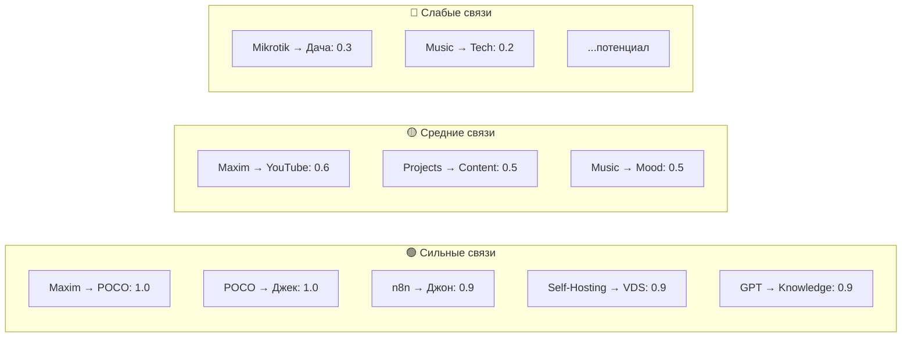
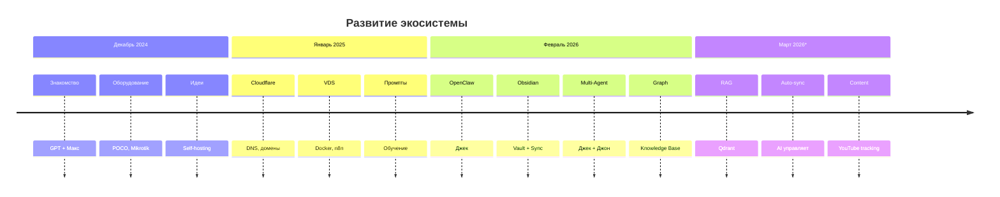
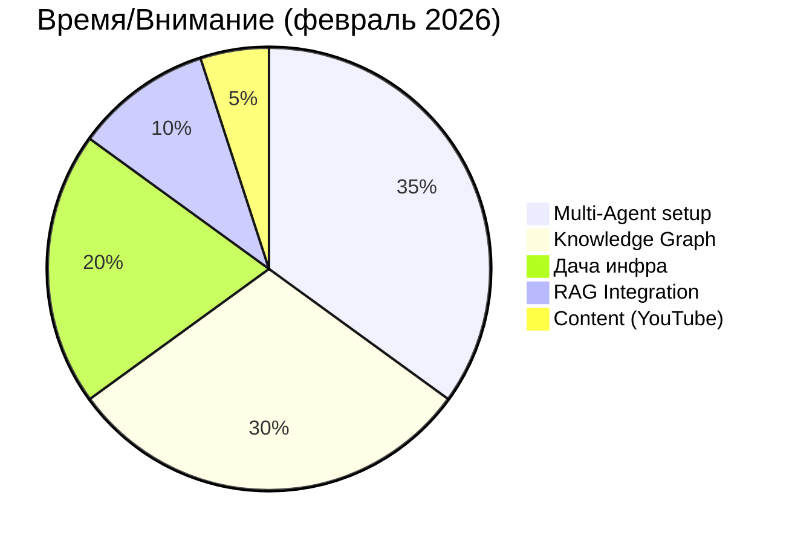
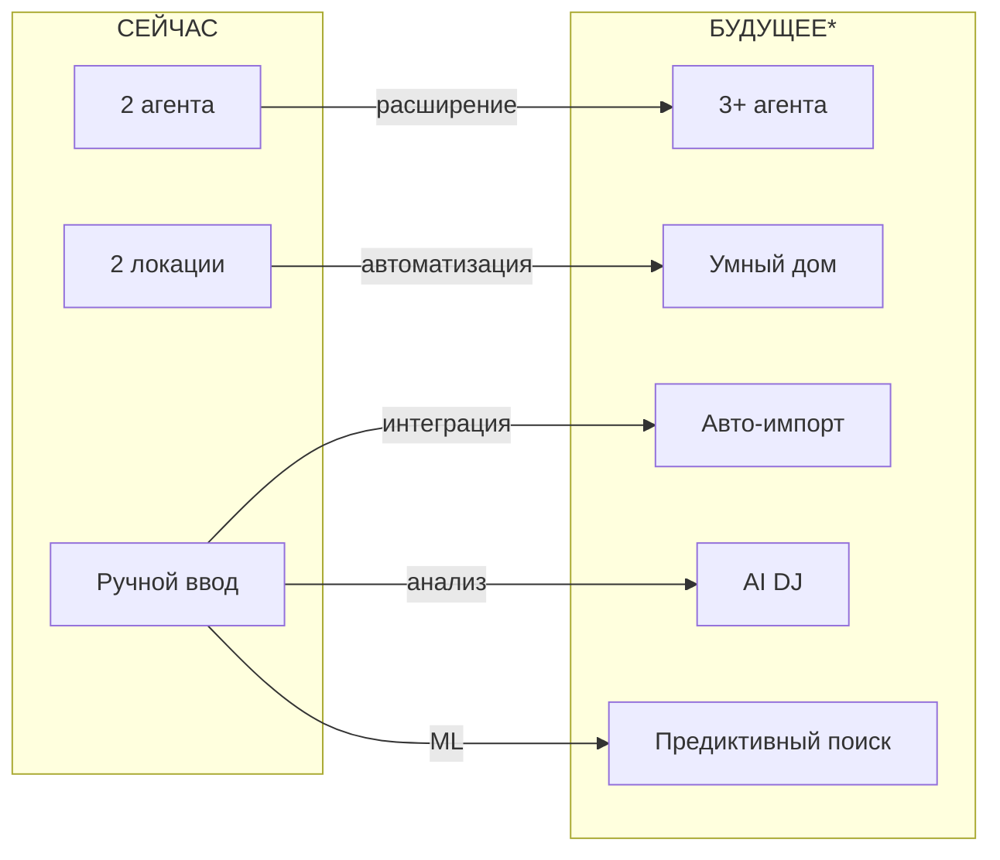

# 🌐 ALL GRAPH: The Big Picture

> Связи между ВСЕМИ доменами: Personal, Tech, Projects, Content

---

## 🎯 Master Graph

```mermaid
graph TB
    subgraph CENTER["🧍 МАКСИМ — ЦЕНТР"]
        M[Максим Яровой<br/>41 год<br/>Сисадмин]<br/>👤 Афантазия
    end
    
    subgraph PERSONAL["👤 Personal Cluster"]
        P1[Трекер дня]
        P2[Предпочтения]
        P3[График работы]
    end
    
    subgraph TECH["💻 Tech Cluster"]
        T1[POCO X6 Pro]
        T2[VDS + Docker]
        T3[n8n]
        T4[OpenWrt]
    end
    
    subgraph PROJECTS["🎯 Projects"]
        PR1[Дача инфра]
        PR2[Multi-Agent]
        PR3[VDS Stack]
        PR4[RAG + Knowledge]
    end
    
    subgraph CONTENT["🎬 Content Graph"]
        C1[YouTube Tech]
        C2[Музыка]
        C3[Обучение]
    end
    
    subgraph AGENTS["🤖 AI Агенты"]
        A1[Джек<br/>Android]
        A2[Джон<br/>Windows]
        A3[? Future]
    end
    
    subgraph DATA["💾 Данные"]
        D1[GPT Conversations]
        D2[Obsidian Vault]
        D3[Knowledge Graph]
    end
    
    CENTER --> PERSONAL
    CENTER --> TECH
    CENTER --> PROJECTS
    CENTER --> CONTENT
    
    PERSONAL --> TECH
    P1 --> T1
    P3 --> PR1
    P2 --> C2
    P3 --> C3
    
    TECH --> PROJECTS
    T1 --> PR2
    T2 --> PR3
    T2 --> PR4
    T3 --> PR2
    
    CONTENT --> PROJECTS
    C1 --> PR3
    C3 --> PR4
    C2 --> PERSONAL
    
    PROJECTS --> AGENTS
    PR2 --> A1
    PR2 --> A2
    
    AGENTS --> DATA
    A1 --> D2
    A2 --> D1
    A1 --> D3
    A2 --> D3
    
    DATA --> CENTER
    D1 -.->|источник| CENTER
```

---

## 📊 Сила связей (Edge Weights)



---

## 🗺️ Cluster Map

```
┌─────────────────────────────────────────────────────────────────┐
│                                                                 │
│   👤 PERSONAL                    💻 TECH                         │
│   ├─ Трекер дня                  ├─ POCO X6 (центр)            │
│   ├─ Афантазия                   ├─ VDS + Docker               │
│   ├─ Предпочтения                ├─ n8n (Джон)                 │
│   ├─ График работы               ├─ OpenWrt                    │
│   └─ Интересы                    └─ Termux                     │
│        │                              │                        │
│        └────────────┬──────────────────┘                          │
│                     │                                           │
│                     ▼                                           │
│   🎯 PROJECTS ◄─────┼─────► 🤖 AGENTS ◄────► 💾 DATA            │
│   ├─ Дача инфра     │       ├─ Джек          ├─ GPT convo       │
│   ├─ Multi-Agent────┘       ├─ Джон          ├─ Obsidian        │
│   ├─ VDS Stack                └─ Future       └─ Knowledge       │
│   └─ RAG + Knowledge                                          │
│                                                                 │
│   🎬 CONTENT                                                    │
│   ├─ YouTube Tech ←─вдохновляет──┐                             │
│   ├─ Музыка ──────настроение─────┼──► PROJECTS                  │
│   └─ Обучение ←────новые идеи───┘                             │
│                                                                 │
└─────────────────────────────────────────────────────────────────┘
```

---

## 🔥 Горячие точки (Active Zones)

### Зона 1: Мультиагентная система 🟥 ВЫСОКАЯ АКТИВНОСТЬ
```
Максим → POCO → Джек → Obsidian ← Джон → n8n ← Вебхук
         │                        ↑
         └────────── Git ─────────┘
```
**Происходит сейчас:** Построение связи между агентами

### Зона 2: Переезд на дачу 🟨 В ПРОЦЕССЕ
```
Квартира → ⏸️ → Дача → ? инфраструктура
```
**Происходит сейчас:** Изменение локации

### Зона 3: Knowledge Graph 🟩 СОЗДАНИЕ
```
36 GPT диалогов → Парсинг → Graph → Visualization
```
**Происходит сейчас:** Компоновка базы знаний

---

## 📈 Эволюция системы



---

## 🎯 Текущий Focus



---

## 🚩 Критические связи (Без них всё ломается)

| Связь | Компоненты | Статус | Риск |
|-------|-----------|--------|------|
| 🤖 Джек→Git→Джон | Multi-Agent | 🟡 400 ошибка | ВЫСОКИЙ |
| 📱 POCO→VDS | SSH | 🟢 Работает | низкий |
| 🌐 n8n webhook | Джон→Джек | ⏳ Настройка | СРЕДНИЙ |
| 🏡 Дача→Интернет | Локация | ❓ Неизвестно | ВЫСОКИЙ |

---

## 💡 Emergent Properties (Свойства системы)

Что появляется из связей:

1. **🧠 Распределенный мозг**
   - Maxim + Jack + John + Knowledge Graph
   - Больше, чем сумма частей

2. **🔄 Self-improving**
   - Данные → Анализ → Улучшение → Новые данные

3. **📊 Вектор предсказания**
   - История показывает: что будет через месяц?

4. **🎨 Mood-aware система**
   - Контент + Трекер → Адаптация под состояние

---

## 🔮 Будущие связи (потенциал)



---

## 📍 Навигация по BIG GRAPH

### Входные точки:
- [[Knowledge-Graph/00-Semantic-Graph-Overview]] ← Смыслы
- [[Projects-Active]] ← Что делаем
- [[Content-Graph/00-Content-Overview]] ← Что смотрим
- [[People/Максим Яровой/Profile-Current-State]] ← Кто я

### Слои:
1. **Personal** → Почему делаем
2. **Tech** → Как делаем
3. **Projects** → Что делаем
4. **Content** → Чем питаемся
5. **AI** → Кто помогает
6. **Data** → Что помним

---

*ALL GRAPH | Master соединитель всех систем*