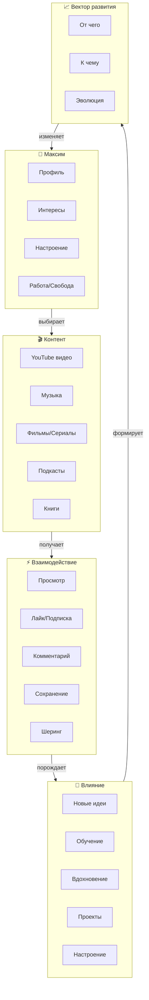
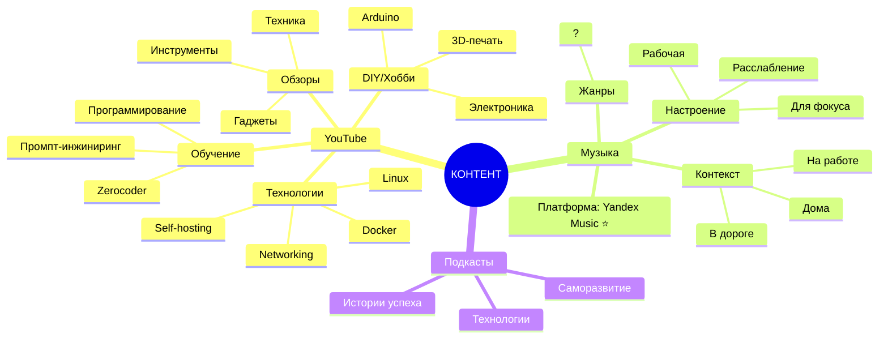
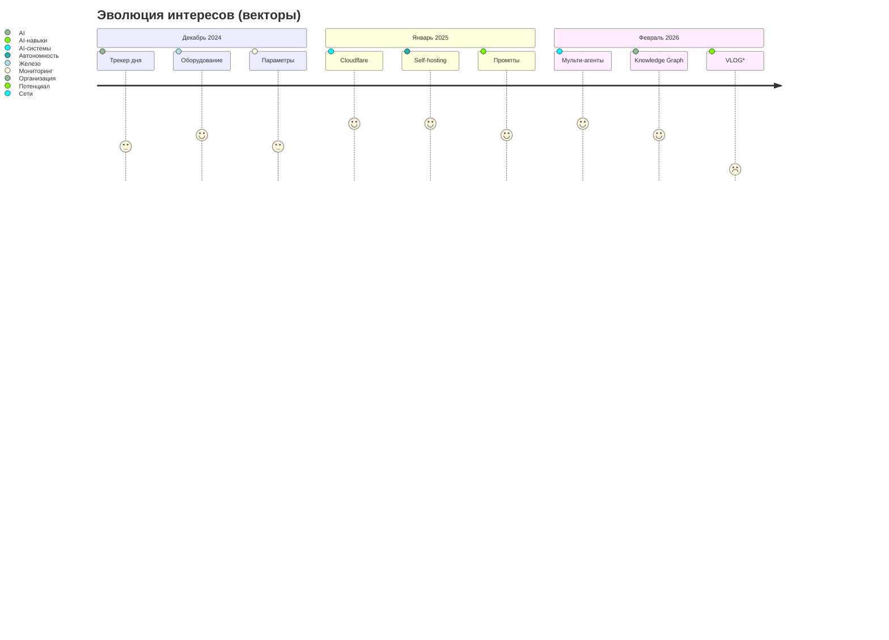
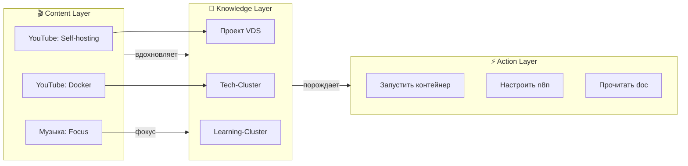
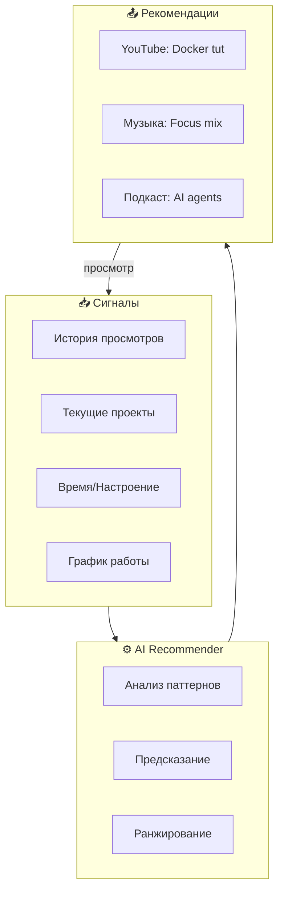
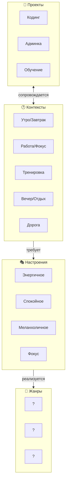

# 🎬 Content Graph: Медиа потребление

> Отслеживание YouTube, музыки, контента и векторов развития интересов

---

## 📊 Модель Content Graph



---

## 🎬 Контент-кластеры



---

## 📈 Архитектура отслеживания

### Уровни взаимодействия

| Уровень | Действие | Вес |
|---------|----------|-----|
| 1️⃣ | Просмотрено 10%+ | 0.5 |
| 2️⃣ | Просмотрено 50%+ | 1.0 |
| 3️⃣ | Просмотрено полностью | 1.5 |
| 4️⃣ | Лайк / Сохранение | 2.0 |
| 5️⃣ | Комментарий / Шеринг | 3.0 |

### Метаданные контента

```yaml
YouTube_Video:
  id: video_id
  title: "Название"
  channel: "Канал"
  category: "Tech/Education/etc"
  watched_at: "2026-02-15"
  watch_time: "12:34 / 45:00"
  interaction_level: 4
  tags: [docker, self-hosting, linux]
  impact: "Новая идея для проекта"
  related_projects: [P002, P003]
  
Music_Track:
  title: "Track"
  artist: "Artist"
  album: "Album"
  genre: "Genre"
  context: "работа/тренировка/отдых"
  mood: "фокус/энергия/спокойствие"
  played_at: "2026-02-15 14:30"
  duration: "3:45"
  repeat_count: 3
```

---

## 🎯 Векторы развития интересов



### Типы векторов

| Тип | Описание | Пример |
|-----|----------|--------|
| **🔄 Циклический** | Возвращение к теме | AI → Железо → AI |
| **➡️ Линейный** | Развитие вглубь | Docker → Kubernetes → Orchestration |
| **🌳 Ветвящийся** | Расширение | Сисадмин → Автоматизация → n8n → AI-агенты |
| **⚡ Импульсный** | Внезапный всплеск | Увидел видео → Новый проект |
| **💀 Затухающий** | Интерес падает | Windows → Linux (переход) |

---

## 🔗 Интеграция с Knowledge Graph



---

## 📋 Структура отслеживания

### Папки:
```
Content-Graph/
├── 00-Content-Overview.md          ← Этот файл
├── YouTube/
│   ├── 2026-02-Watched.md          ← История просмотров
│   ├── Saved.md                     ← Сохраненные
│   └── Channels.md                  ← Отслеживаемые каналы
├── Music/
│   ├── Currently-Playing.md         ← Что сейчас
│   ├── Playlists.md                 ← Плейлисты
│   └── Mood-Context.md              ← По настроению
├── Impact-Log/
│   ├── 2026-02-15-New-Ideas.md     ← Идеи от контента
│   └── Inspiration-Board.md           ← Вдохновение
└── Vectors/
    ├── Interest-Evolution.md          ← Изменение интересов
    └── Content-Routine.md             ← Рутина потребления
```

---

## 💡 Recommender System (идея)



---

## 🎬 YouTube Integration

### Как импортировать

**Вариант 1: Ручной** (сейчас)
```yaml
- title: "Как настроить n8n за 10 минут"
  channel: "TechCraft"
  url: "https://youtube.com/watch?v=..."
  watched: "2026-02-15"
  tags: [n8n, automation, tutorial]
  impact: "Узнал про webhook nodes"
  project: P002
  rating: 5/5
```

**Вариант 2: Takeout** (Google Data)
- Google Takeout → YouTube.json
- Парсинг истории просмотров
- Авто-импорт в Obsidian

**Вариант 3: YouTube API**
- OAuth доступ
- Авто-синхронизация
- Нужна разработка

---

## 🎵 Музыкальная карта



> ⚠️ **Заполнить:** Предпочтения Максима будут собираться через тесты в GPT-диалогах

---

*Content Graph | Ждет импорта YouTube/Music данных*