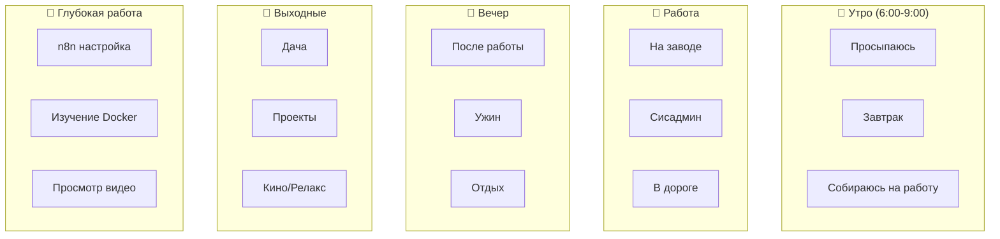
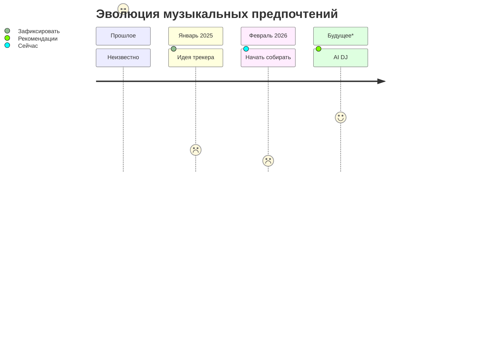

# 🎵 Музыка: Настроение и контекст

> Связь музыкальных предпочтений с активностями

---

## 🎭 Контексты прослушивания



---

## 📋 Шаблон трекинга

### Добавить трек:
```markdown
### 🎵 Исполнитель — Трек
- **Альбом:** 
- **Жанр:** 
- **Контекст:** работа/дача/дорога/тренировка
- **Настроение:** фокус/энергия/спокойствие
- **Повторов:** N
- **Связан проект:** [[PROJECT-X]]
```

---

## 🎧 Плейлисты по активностям

### 💻 Фокус (кодинг, настройка)
> Тэг: `#focus #coding`
```
Жанр: ?
Примеры: ???
mood: спокойный, без слов, ритмичный
```

### 🏃 Энергия (сборы, дорога)
> Тэг: `#energy #workout`
```
Жанр: ?
Примеры: ???
mood: энергичный, драйв
```

### 🧘 Расслабление (вечер, дача)
> Тэг: `#chill #evening`
```
Жанр: ?
Примеры: ???
mood: спокойный, меланхоличный, атмосферный
```

### 📚 Обучение (видео, чтение)
> Тэг: `#learning #background`
```
Жанр: ?
Примеры: ???
mood: без слов, не отвлекает, нейтральный
```

---

## 📊 Вектор музыкальных интересов



---

## 🎵 Открытые вопросы

> **GPT будет спрашивать:**

### Тесты для определения:
- [ ] Какие жанры нравятся? (рок/электро/классика/джаз)
- [ ] Тексты или инструментал?
- [ ] Энергичная или спокойная?
- [ ] Зарубежная или русская?
- [ ] Любимые исполнители?
- [ ] Какую музыку слушал в молодости?
- [ ] Есть ли "рабочий" плейлист?
- [ ] Музыка для фокуса vs расслабления?

### Результаты будут здесь:
```yaml
Жанры:
  main: ???
  secondary: ???
  
Исполнители:
  top: ???
  
Плейлисты:
  focus: ???
  energy: ???
  chill: ???
  
Музыкальный профиль:
  type: ???
  discovered: ???
```

---

## 🔗 Связи

- [[../../Personal-Cluster/Preferences]] ← Предпочтения
- [[../00-Content-Overview]] ← Общая структура
- [[../../People/Profile-Current-State]] ← Профиль

---

*Music Mood | Ждет заполнения через диалоги с GPT*