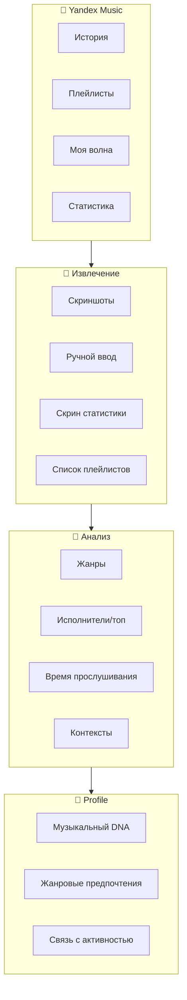
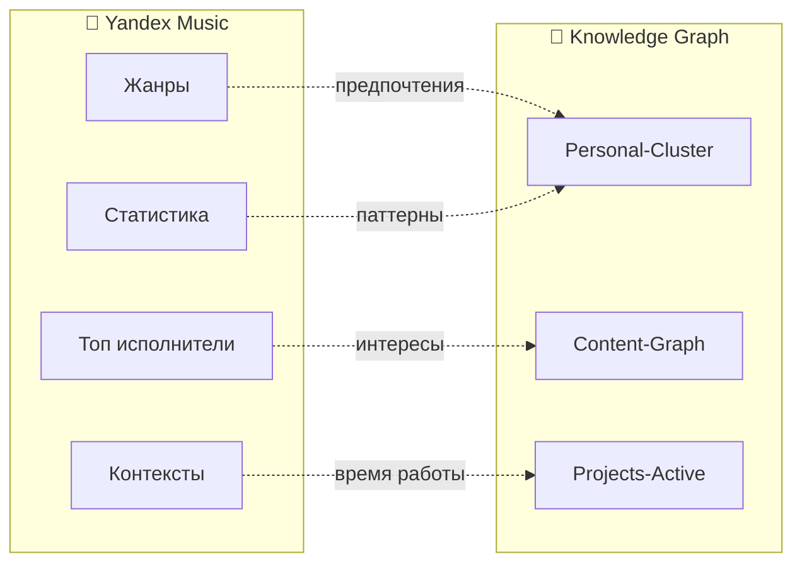

# 🎵 Yandex Music Profile

> Музыкальные предпочтения через Yandex Music

---

## 📱 Платформа: Yandex Music

**Источник:** Yandex Music (Яндекс.Музыка)  
**Статус:** Основной стриминг-сервис  
**Интеграция:** App/Android/Браузер  

---

## 🎯 Что доступно из Yandex Music

### Данные которые можно получить:

#### 1. **История прослушиваний**
- Ватчана в приложении
- Нельзя экспортировать официально
- Можно смотреть вручную: Профиль → История

#### 2. **Плейлисты**
- Свои плейлисты
- Любимые треки
- Моя волна
- Радио (история вроде не сохраняется)

#### 3. **Аналитика**
- **В моём вкусе:**
  Статистика за неделю/месяц/год (хит парад)
- **Ретроспектива:**
  Итоги года (декабрь)
- **Сводка:**
  Жанры, исполнители, треки

---

## 📊 Возможности анализа



---

## 🎵 Опрос: Твой Yandex Music

### Базовые вопросы:

#### 1. **Жанры**
Что преобладает в "Моём вкусе" / плейлистах?

- [ ] Русский рок
- [ ] Зарубежный рок
- [ ] Тяжёлая музыка (метал)
- [ ] Поп
- [ ] Электронная (техно, хаус, транс)
- [ ] Шансон/воровской шансон
- [ ] Русский рэп
- [ ] Зарубежный рэп/хип-хоп
- [ ] Классическая
- [ ] Джаз
- [ ] Фолк/акустика
- [ ] Инструментальная
- [ ] Другой: ___________

#### 2. **Эпохи**
Что больше - старое или новое?

- [ ] 🎸 80е-90е-00е (ностальгия)
- [ ] 🎤 2000е-2010е
- [ ] 🎧 Новое (2020+)
- [ ] ⚖️ Смешанное

#### 3. **Язык**
- [ ] Переважет русское
- [ ] Переважет зарубежное
- [ ] Примерно поровну

#### 4. **Время прослушивания**
Когда слушаешь?

| Время | Тип музыки |
|-------|-----------|
| Утро (6-9) | _________________ |
| Дорога на работу | _________________ |
| На работе (завод) | _________________ |
| На работе (сисадмин) | _________________ |
| После работы | _________________ |
| Вечер дома | _________________ |
| Выходные/дача | _________________ |

#### 5. **Функции Yandex Music**
Что используешь?

- [ ] **Моя волна** (персональное радио) - основное
- [ ] **Любимые треки** (сердечки)
- [ ] **Свои плейлисты** (создаю сам)
- [ ] **Новости музыки** (что нового)
- [ ] **Плейлисты под настроение** (от Яндекса)
- [ ] **Подкасты**
- [ ] **Книги/Аудиокниги**

#### 6. **Тип прослушивания**
- [ ] 🎲 **Волна** — доверяю алгоритму
- [ ] 🎯 **Конкретное** — знаю что хочу
- [ ] 📋 **Плейлисты** — заготовленное
- [ ] 🔄 **Смешанное**

#### 7. **Топ-5 исполнителей**
(Кто чаще всего в избранном/плейлистах)

1. ___________________
2. ___________________
3. ___________________
4. ___________________
5. ___________________

#### 8. **Топ-5 треков**
(Последние часто слушаемые или любимые)

1. ___________________
2. ___________________
3. ___________________
4. ___________________
5. ___________________

#### 9. **Музыка для...
| Активность | Что слушаешь? | Пример трека/артист |
|------------|-------------|---------------------|
| Фокус (глубокая работа) | ____________ | ___________________ |
| Энергия (утро, активность) | ____________ | ___________________ |
| Расслабление (вечер) | ____________ | ___________________ |
| Дорога на работу | ____________ | ___________________ |
| Сисадмин (настройка) | ____________ | ___________________ |
| Завод (рутина) | ____________ | ___________________ |

---

## 📱 Где посмотреть статистику

### В приложении Yandex Music:

**Путь:** Профиль → Статистика → В моём вкусе

Что там есть:
- 🎵 Жанровая диаграмма
- 🎤 Топ исполнителей (неделя/месяц/год/всё время)
- 📻 Топ треков
- ⏱️ Время прослушивания

**Идеально:** Скриншот этой страницы

---

## 🔗 Интеграция с Knowledge Graph

### Связи:



---

## 🎨 Music-Mood Map

### Связь с активностями (заполнить):

```yaml
Утро/заряд:
  mood: энергия, пробуждение
  example: ???

Работа сисадмин:
  mood: фокус, концентрация
  example: ???

Работа завод:
  mood: автоматизм, ритм
  example: ???

После работы:
  mood: расслабление
  example: ???

Дача/выходные:
  mood: свобода
  example: ???
```

---

## 📤 Как передать данные

### Вариант 1: Ответить здесь
Просто ответь на вопросы выше в чате

### Вариант 2: Скриншоты
- Скриншот "Мой вкус" / статистики
- Список плейлистов
- Любимые треки

### Вариант 3: Ручной ввод
Открыть Yandex Music → Написать в ответе:
- Топ-10 треков
- Топ-5 исполнителей
- 3 основных плейлиста

---

## 🎯 После анализа

### Что создаю:

1. **Music-DNA.md** — музыкальный профиль
2. **Genre-Timeline.md** — изменение предпочтений
3. **Mood-Activity-Map.md** — связь музыка ↔ активность
4. **Yandex-Insights.md** — инсайты из статистики
5. **Recommendation-Engine.md** — что послушать дальше

---

*Yandex Music Profile | Относительно российского контента*