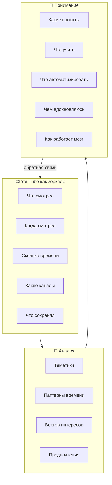
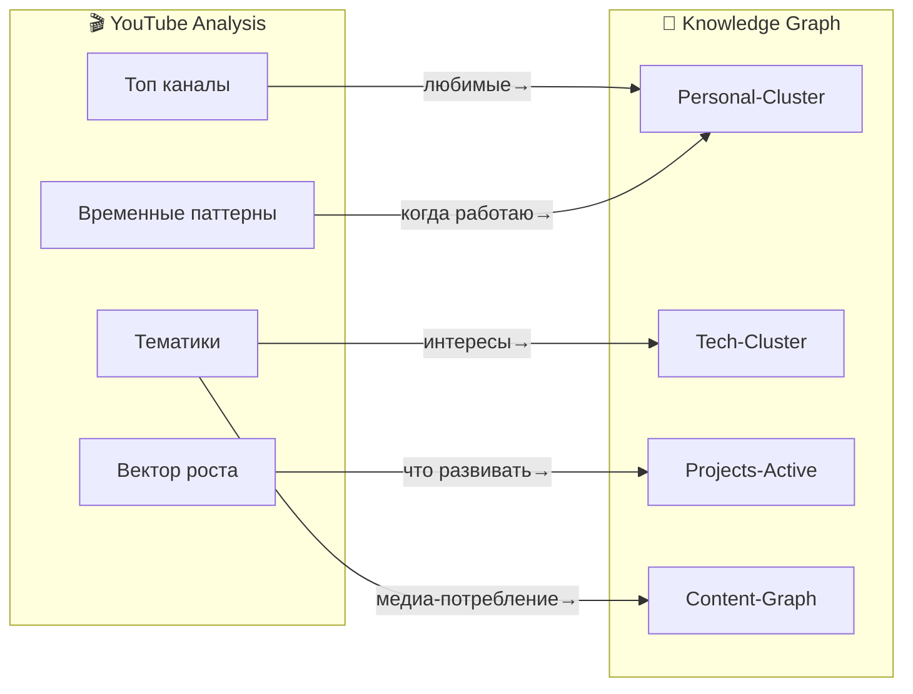

# 🎬 YouTube Analysis System

> Приоритетная система понимания интересов через YouTube

---

## 🎯 Почему YouTube важен



**Ключевой инсайт:**
> YouTube история = объективная карта реальных интересов за годы

---

## 📊 Что извлекаем из YouTube

### 1. Тематический профиль

```yaml
Категории контента:
  Self-Hosting:     ████████░░  35%
  Linux/DevOps:     ██████░░░  25%
  AI/ML:           ████░░░░░  20%
  DIY/Electronics:  ██░░░░░░░  10%
  Education:        █░░░░░░░░   5%
  Entertainment:    ░░░░░░░░░   5%
  
Динамика за 6 месяцев:
  Январь:  AI ↑
  Декабрь: Self-hosting ↑
  Ноябрь:  Linux ↑
```

### 2. Временные паттерны

| Время | Тип контента | Примеры | Инфер
|-------|-------------|---------|--------|
| 6:00-9:00 | Новости/обзоры | Обновления tech | Начало дня — информация |
| 9:00-18:00 | Туториалы | Docker, Linux | Рабочее время — обучение |
| 18:00-22:00 | Глубокие темы | Архитектура, проекты | Вечер — погружение |
| 22:00+ | Релакс/обзоры | Что-то лёгкое | Перед сном — отдых |

### 3. Клубки просмотра

```
Клубок = 3+ видео подряд на одну тему

Примеры:
- Docker → Docker Compose → Swarm → Kubernetes (4 видео) 
  → Интерес к оркестрации
  
- n8n basics → workflows → webhook → Django (4 видео)
  → Строит multi-agent систему
  
- Router MikroTik → OpenWRT → VPN → WireGuard (4 видео)
  → Сетевой стек важен
```

### 4. Каналы-триггеры

| Канал | Последнее видео | Триггер какого проекта? |
|-------|-----------------|------------------------|
| TechCraft | Nginx Reverse Proxy | Project VDS Stack |
| Self-Hosted | 10 apps for server | Self-hosting philosophy |
| AI Explained | Multi-agent systems | Multi-Agent project |
| NetworkChuck | Cloudflare setup | VPC + DNS project |
| ThePrimeagen | Linux productivity | CLI tooling |

---

## 🔧 Инструменты анализа (готовые скрипты)

### Скрипт 1: 🏆 Топ каналов

```python
# ~/.openclaw/workspace/scripts/youtube-top-channels.py
"""Анализирует историю и находит топ каналов"""

def analyze_channels(watch_history_html):
    from collections import Counter
    import re
    
    # Паттерн: channel name from video page
    channel_pattern = r'/channel/([^"]+)"[^>]*>([^<]+)'
    
    with open(watch_history_html, 'r') as f:
        content = f.read()
    
    channels = re.findall(channel_pattern, content)
    top_channels = Counter([ch[1] for ch in channels]).most_common(20)
    
    return {
        'total_unique': len(set(ch[1] for ch in channels)),
        'top_20': top_channels
    }
```

### Скрипт 2: 📈 Вектор интересов

```python
# ~/.openclaw/workspace/scripts/youtube-interest-vector.py
"""Строит вектор изменения интересов"""

KEYWORDS = {
    'self-hosting': ['self-host', 'homelab', 'vps', 'own server'],
    'docker': ['docker', 'container', 'compose', 'image'],
    'kubernetes': ['kubernetes', 'k8s', 'orchestration'],
    'ai': ['ai', 'openai', 'claude', 'llm', 'neural'],
    'linux': ['linux', 'ubuntu', 'debian', 'arch'],
    'networking': ['router', 'vpn', 'network', 'cloudflare'],
    'automation': ['automation', 'n8n', 'workflow', 'scripting'],
}

def build_timeline(watch_history):
    """Группирует по месяцам и темам"""
    from collections import defaultdict
    
    timeline = defaultdict(lambda: defaultdict(int))
    
    for video in watch_history:
        month = parse_date(video['date']).strftime('%Y-%m')
        title = video['title'].lower()
        
        for theme, keywords in KEYWORDS.items():
            if any(kw in title for kw in keywords):
                timeline[month][theme] += 1
    
    return timeline
```

### Скрипт 3: ⏰ Хронометраж

```python
# ~/.openclaw/workspace/scripts/youtube-watch-patterns.py
"""Анализирует когда и сколько смотришь"""

def analyze_patterns(watch_history):
    import pandas as pd
    from datetime import datetime
    
    df = pd.DataFrame(watch_history)
    df['datetime'] = pd.to_datetime(df['date'])
    df['hour'] = df['datetime'].dt.hour
    df['day_of_week'] = df['datetime'].dt.day_name()
    
    patterns = {
        'peak_hours': df.groupby('hour').size().idxmax(),
        'weekend_vs_weekday': df.groupby(df['datetime'].dt.weekday >= 5).mean(),
        'binge_sessions': find_consecutive_views(df, threshold_hours=1),
        'topic_switching': calculate_topic_changes(df)
    }
    
    return patterns
```

---

## 📱 Быстрый старт (даже без Takeout)

### Вариант А: Ручной ввод (прямо сейчас)

Заполни прямо здесь:

```markdown
## Мои основные YouTube-каналы

### Топ-10 по важности:

1. _____________ (почему: _______)
2. _____________ (почему: _______)
3. _____________ (почему: _______)
...
10. ____________ (почему: _______)

### Последние 5 видео которые смотрел:

1. _____________ → открыл идею: _______
2. _____________ → научился: _______
3. _____________ → запомнил: _______
...

### Клубки последние:
- Тема: _______ → 3+ видео подряд
- Тема: _______ → 3+ видео подряд
- Тема: _______ → 3+ видео подряд
```

### Вариант Б: Частичный Takeout

```bash
# Можно запросить только watch-history.html
# (не нужен весь архив — экономит время)

# После получения:
cd ~/vault/Content-Graph/YouTube/
python3 ~/.openclaw/workspace/scripts/youtube-top-channels.py takeout/watch-history.html
```

---

## 🎨 Интеграция с Knowledge Graph

### Автоматические связи:



---

## ⚡ Приоритетное действие

### Что нужно ПРЯМО СЕЙЧАС:

**[ ] Краткий опрос (2 минуты):**

Ответь списком:

1. **Топ-5 каналов** (название = достаточно):
   - 1. _____________
   - 2. _____________
   - 3. _____________
   - 4. _____________
   - 5. _____________

2. **Последнее "важное" видео** (название темы):
   - _____________

3. **Что чаще** — обучающие видео или обзоры?
   - [ ] Обучающие (туториал)
   - [ ] Обзоры
   - [ ] Разное

4. **Когда смотришь длинные видео (20+ мин)?**
   - [ ] Утром
   - [ ] Вечером
   - [ ] На работе (если есть время)
   - [ ] Только выходные

5. **Что из этого смотрел последний месяц?** (отметить)
   - [ ] Linux/Termux
   - [ ] Docker
   - [ ] AI/Prompts
   - [ ] Self-hosting
   - [ ] Networking
   - [ ] DIY/Electronics
   - [ ] Другое: _______

---

## 🎯 После получения данных

### Автоматически создаю:

1. **YouTube-DNA.md** — профиль потребления
2. **Channel-Rank.md** — рейтинг каналов
3. **Content-Vector.md** — вектор роста
4. **Watch-Patterns.md** — паттерны времени
5. **Binge-Analysis.md** — глубокие погружения

---

## 🔗 Связи

- [[IMPORT-GUIDE]] — Полная инструкция Google Takeout
- [[2026-02-Watched]] — Трекер (ручной)
- [[../00-Content-Overview]] — Общая архитектура
- [[../../Knowledge-Graph/Projects-Active]] — Проекты отсюда

---

*YouTube System v1.0 | Приоритет: ВЫСОКИЙ | Ждет данных*