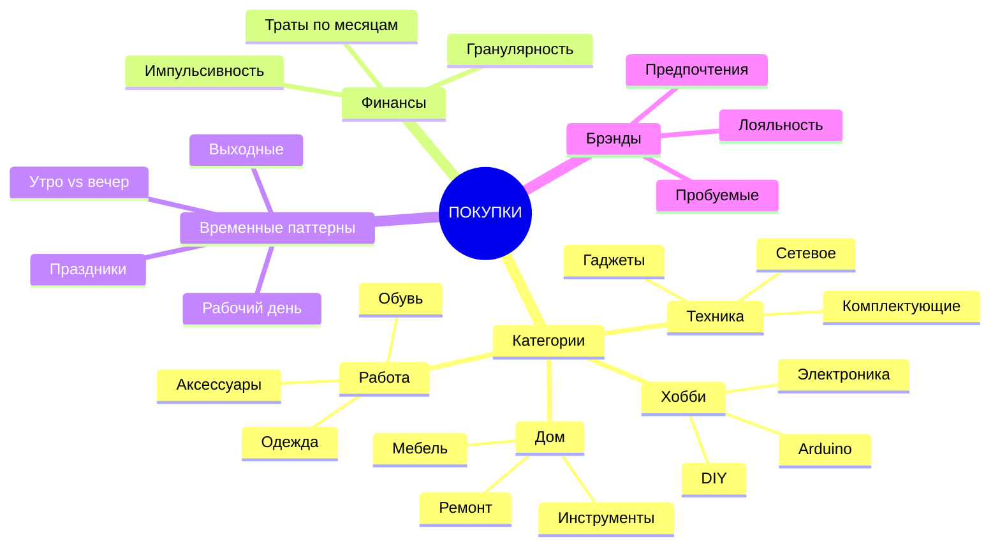
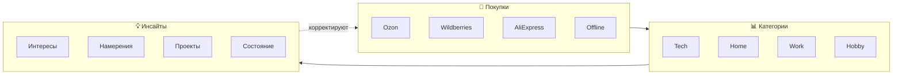

# 🛒 Shopping Analysis: Анализ покупок

> Понимание интересов через потребительское поведение

---

## 🏪 Поддерживаемые платформы

| Платформа | Тип | Данные | Статус |
|-----------|-----|--------|--------|
| **Ozon** | Маркетплейс | Заказы, категории | 🎯 Запланировано |
| **Wildberries** | Маркетплейс | Покупки, брэнд-преференции | 🎯 Запланировано |
| **AliExpress** | Кросс-бордер | Импорт, доставка | 🎯 Запланировано |
| **Яндекс Маркет** | Маркетплейс | Техника, сравнения | 🎯 Запланировано |
| **DNS** | Электроника | Техника, сборки | 🎯 Запланировано |
| **Ситилинк** | Электроника | Комплектующие | 🎯 Запланировано |
| **СберМегаМаркет** | Маркетплейс | Разная продукция | 🎯 Запланировано |
| **Offline retail** | Физические | Глобус, Лента, etc | 🎯 Скриншоты/JSON |

---

## 📊 Что анализируем

### Паттерны покупок:



---

## 🛍️ Инструменты сбора

### 1. Официальные экспорты

#### Ozon:
```
ЛК → Заказы → История → Экспорт?
```
**Доступно:** Листалка, но полный экспорт? (нужно проверить)

#### Wildberries:
```
ЛК → Покупки → История → Экспорт?
```
**Доступно:** Полный список, но API?

#### AliExpress:
```
My Orders → Export? (ограничено)
```

### 2. Скриншот анализ

**Быстрый метод:**
1. Открыть "Мои заказы" в приложении
2. Сделать скриншоты списка
3. Джек/OCR извлекает:
   - Названия товаров
   - Даты
   - Цены
   - Категории (инференс)

### 3. API доступ (если есть)

```python
# Для каждого сервиса можно попробовать:

OZON_API = "https://api-seller.ozon.ru/"  # Требует seller аккаунт
WB_API = "https://suppliers-api.wildberries.ru/"  # Требует API ключ
ALI_API = "Экспорт заказов ограничен"
```

**Реальность:** Сложно получить API как покупатель

### 4. Парсинг email

**Gmail/Yandex/...**
```
Поиск: "заказ оформлен" OR "подтверждение" 
От: ozon, wildberries, aliexpress
```

---

## 🎯 Шаблон сбора данных

### Самостоятельный ввод (быстро):

#### Ozon последние 10 заказов:
```markdown
| # | Товар | Категория | Дата | Цена |
|---|-------|-----------|------|------|
| 1 | _____________ | __________ | _____ | _____ |
| 2 | _____________ | __________ | _____ | _____ |
| ... | ... | ... | ... | ... |
```

#### Топ категории (Ozon):
- [ ] Электроника
- [ ] Компьютеры
- [ ] Инструменты
- [ ] Дом/ремонт
- [ ] Одежда
- [ ] Книги
- [ ] Хобби
- [ ] Другое: _____

#### Wildberries последние 10:
```markdown
| # | Товар | Брэнд | Дата |
|---|-------|-------|------|
| 1 | _____________ | ______ | _____ |
| ... | ... | ... | ... |
```

#### AliExpress последние 5 посылок:
```markdown
| # | Товар | Дата заказа | Дата получения |
|---|-------|-------------|----------------|
| 1 | _____________ | ___________ | ______________ |
| ... | ... | ... | ... |
```

---

## 🧠 Интеграция с профилем

### Что покупки говорят о человеке:

| Паттерн | Интерпретация |
|-----------|---------------|
| Часто техника | Интерес к гаджетам |
| Комплектующие ПК | Сборка/апгрейд |
| Сетевое оборудование | Homelab/роутинг |
| Инструменты | DIY/ремонт |
| Книги по программированию | Обучение |
| Товары на дачу | Переезд/строительство |
| Arduino/RPi | Электроника хобби |
| Много мелких заказов | Импульсивность |
| Редкие но дорогие | Целенаправленность |
| Образцы/пробники | Исследования |

---

## 📈 Анализ покупательских паттернов



**Пример связи:**
```
Заказ: "USB-C Ethernet adapter" 
→ Категория: Сетевое + адаптеры
→ Интерес: Сеть + телефон как центр
→ Проект: Подключение Mikrotik к POCO
→ Timeline: Срочно (ждет адаптер)
```

---

## 🔗 Связь с другими данными

### Корреляции:

| Покупка | Связь с |
|---------|---------|
| USB-C хаб | POCO + Mikrotik проект |
| Элементы питания | DIY electronics |
| Корпус для ПК | VDS/Self-hosting проект |
| Книга по Docker | Обучение, Content-Graph |
| Инструменты | Дача, строительство |
| Светодиодная лента | Умный дом проект |
| Сетевой фильтр | Сетевая инфраструктура |
| Датчики/сенсоры | Home Assistant |

---

## 🚀 Быстрый профиль покупок

**Заполни быстро (5 минут):**

### Последние покупки (вспомни последние 2 недели):

1. _______________________________ (магазин: ___ )
   Почему?: _______________________

2. _______________________________ (магазин: ___ )
   Почему?: _______________________

3. _______________________________ (магазин: ___ )
   Почему?: _______________________

4. _______________________________ (магазин: ___ )
   Почему?: _______________________

5. _______________________________ (магазин: ___ )
   Почему?: _______________________

### Что чаще всего ищешь/покупаешь?
- [ ] Техника/электроника
- [ ] Комплектующие
- [ ] Инструменты
- [ ] Для дома
- [ ] Дача/стройка
- [ ] Одежда
- [ ] Хобби
- [ ] Книги

---

## 🎯 Интеграция в Knowledge Graph

```yaml
Покупательский_профиль:
  Платформы:
    ozon: ["категории", "частота"]
    wildberries: ["категории", "брэнды"]
    aliexpress: ["импорт", "хобби"]
    offline: ["где", "что"]
    
  Паттерны:
    импульсивность: "высокая/низкая"
    планирование: "долго изучаю/сразу купил"
    категории_топ: ["техника", "инструменты", "хобби"]
    
  Связи_с_проектами:
    Дача: ["инструменты", "строительство"]
    VDS: ["сетевое", "комплектующие"]
    Multi-Agent: ["хабы", "адаптеры"]
    Умный_дом: ["сенсоры", "лепта"]
```

---

## 💡 Глубокие инсайты

### Что покупки покажут:

1. **Распредление времени/денег**
   - Работа vs хобби vs быт

2. **Этапы проектов**
   - Сначала: исследование (книги, модули)
   - Потом: покупка (комплектующие)
   - Затем: дополнительные (аксессуары)

3. **Неосознанные интересы**
   - "Случайно купил" → на самом деле хотел давно

4. **Планируемое vs импульс**
   - План: VDS годами
   - Импульс: "Вот это классно!" → новый хобби

---

## 📊 Хранение в vault

```
vault/Data-Sources/
├── Shopping-Analysis.md          ← Это файл
├── ozon/
│   └── purchases-2026.csv        ← Экспорт/вручную
├── wildberries/
│   └── purchases-2026.csv
├── aliexpress/
│   └── orders-2026.csv
└── insights/
    ├── purchase-patterns.md
    └── category-evolution.md
```

---

*Shopping Analysis | Понимание через потребление*