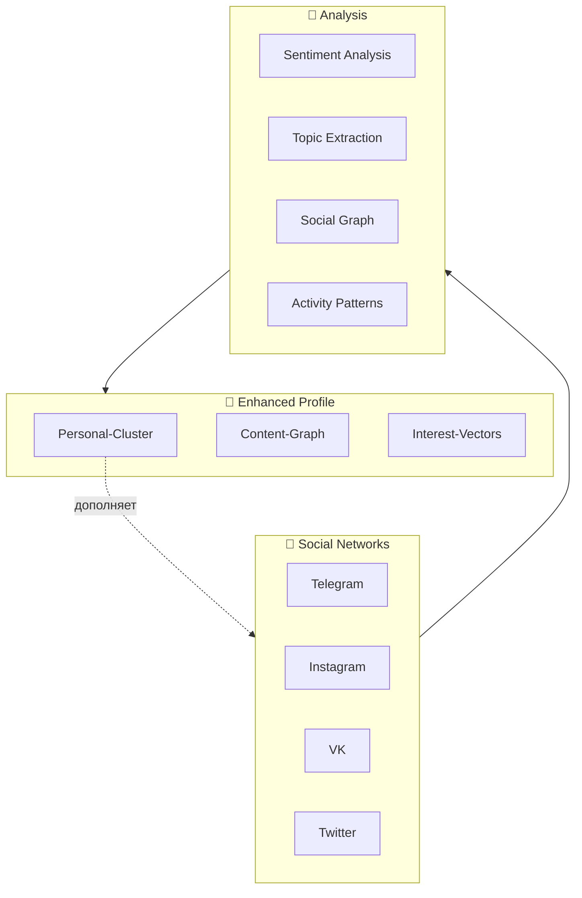

# 👥 Social Networks Profile

> Интеграция данных из соцсетей в Knowledge Graph

---

## 📱 Поддерживаемые платформы

| Платформа | Данные | Статус | Метод |
|-----------|--------|--------|-------|
| **Telegram** | Сообщения, каналы, контакты | 🟢 Активно | Local + API |
| **Instagram** | Посты, лайки, подписки | ⏳ Запланировано | Takeout/API |
| **VK** | Стена, группы, музыка | ⏳ Запланировано | API/Export |
| **YouTube** | (см. Content-Graph) | 🟢 В процессе | Takeout |
| **Twitter/X** | Твиты, лайки | ⏳ Запланировано | Archive |
| **Facebook** | (если используется) | ⏳ Запланировано | Takeout |
| **LinkedIn** | Профессиональные связи | ⏳ Запланировано | Export |
| **TikTok** | Просмотры, лайки | ⏳ Запланировано | Скриншоты |
| **Reddit** | Подписки, комменты | ⏳ Запланировано | API/Export |

---

## 🔧 Методы извлечения

### 1. Telegram (приоритет: ВЫСОКИЙ)

**Уже доступно:**
- ✅ Telegram чаты с Gemphonebot (Джон)
- ✅ Telegram каналы
- ✅ Интеграция через OpenClaw

**Дополнительно извлечь:**
- 📋 Сохраненные сообщения
- 📋 Избранное (Favorites)
- 📋 Каналы которые читаю
- 📋 Группы для работы
- 📋 Боты которыми пользуюсь

**Как:**
```bash
# Desktop Telegram → Settings → Advanced → Export data
# Получаем JSON с:
# - chats.json
# - contacts.json  
# - saved_messages.json
```

**Связь с Knowledge Graph:**
- Каналы чтения → Интересы
- Сообщения гиперлинками → Контент
- Группы → Социальные связи

---

### 2. Instagram

**Instagram Data Download:**
```
Settings → Security → Download Data
```

**Данные:**
- 📷 Посты (фото + описания)
- ❤️ Лайки
- 🔗 Ссылки в профиле
- 💬 Комментарии
- 🏷️ Stories (если сохранены)

**Инсайты:**
- Визуальные предпочтения
- Что нравится изображать
- Стили/цвета
- Тематика постов

---

### 3. VK

**VK Data Export:**
```
Settings → Privacy → Export Data
```

**Данные:**
- 📝 Стена (посты)
- 🎵 Музыка
- 🎥 Видео
- 👥 Друзья, группы
- 💬 Комментарии

**Инсайты:**
- Музыкальные предпочтения (дополнение к Yandex)
- Группы → Интересы
- Посты → Мысли/политика/юмор

---

### 4. Twitter/X

**Twitter Archive:**
```
Settings → Your account → Download archive
```

**Данные:**
- 🐦 Твиты
- 🔖 Закладки
- ❤️ Лайки
- 👥 Списки

---

## 🎯 Структура профиля соцсетей

```yaml
Telegram:
  username: ?
  saved_channels:
    - технические
    - образовательные
    - развлекательные
  work_groups: []
  bots_used: []

Instagram:
  username: ?
  post_themes:
    - личное
    - технологии
    - хобби
  liked_accounts: []
  visual_style: ?

VK:
  music_genres: []
  subscribed_groups: []
  post_frequency: ?
  
Twitter:
  interests_tags: []
  retweet_patterns: []
```

---

## 🔗 Интеграция с Knowledge Graph



---

## 📊 Анализ соцсетей через агентов

### Telegram анализ (уже работает):

**Джек (OpenClaw) анализирует:**
- 📩 Входящие сообщения
- 💬 Групповые чаты
- 📊 Частота общения
- 🔗 Отправленные ссылки

**Инсайты:**
- Когда активен
- Какие темы обсуждает
- Рабочие vs личные чаты
- Ответственность и реакции

---

## 🚀 Быстрый старт

**Что сделать прямо сейчас:**

1. **Telegram** — уже собирается через OpenClaw
   - [x] Сообщения в журнале
   - [ ] Экспорт полной истории (опционально)

2. **Запросить данные:**
   - [ ] Instagram Export
   - [ ] VK Export  
   - [ ] Twitter Archive
   - [ ] Facebook Takeout

3. **Скинуть скриншоты профилей** (быстрый вариант):
   - Подписки
   - Лайки
   - Сохраненное

---

*Social Networks Profile | Расширение Knowledge Graph*