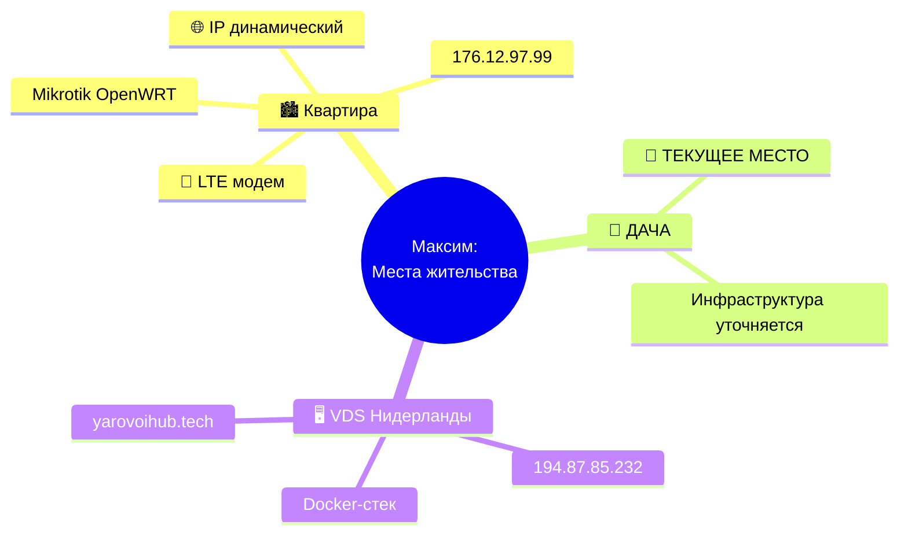
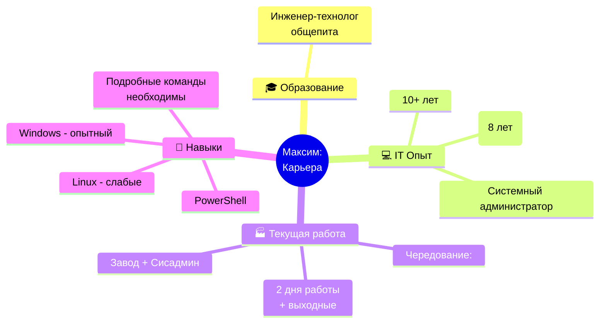
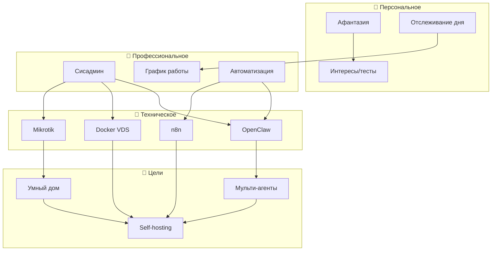
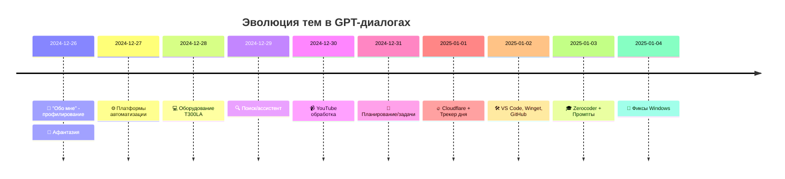
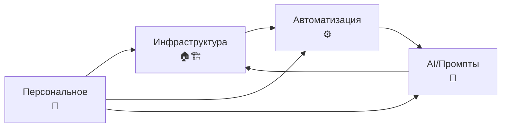

# 🗺️ Mindmap: Анализ GPT-диалогов

> Визуализация доменов, связей и инфраструктуры из 36 диалогов

---

## 1. 🏠 Жизненные локации (Map: LOCATIONS)



**Вывод из диалогов:**
- Ранее: Жил в квартире, работал с двух мест
- Сейчас: **Переезд на дачу** (февраль 2026)
- Мобильность: Смартфон как центр управления

---

## 2. 💼 Карьера (Map: CAREER)



**Ключевые диалоги:**
- [[Personal/2025-01-01_67755f28]] - Трекер состояния + график работы
- [[Personal/2024-12-26_676d7973]] - "Обо мне" - полный профиль

---

## 3. 🏗️ Инфраструктура (Map: INFRASTRUCTURE)

```mermaid
graph TB
    subgraph 📱_Android["📱 POCO X6 Pro 5G (Android 14)"]
        Termux[Termux SSH]
        Apps[Приложения]
        OpenClaw[OpenClaw<br/>Джек]
    end

    subgraph 🏠_ДОМАШНИЕ["🏠 ДОМАШНИИЕ СЕТИ"]
        subgraph Квартира["Квартира (LTE)"]
            Mikrotik[Mikrotik<br/>OpenWRT<br/>176.12.97.99]
            HomeSrv[HomeSrv<br/>старая инфра]
        end
        subgraph ДАЧА["🏡 ДАЧА (ТЕКУЩАЯ)"]
            Dacha_infra[Инфраструктура<br/>в разработке]
        end
    end

    subgraph 🌍_VDS["🌍 VDS Timeweb (Нидерланды)"]
        Docker[Docker Stack]
        NginxPM[Nginx Proxy<br/>Manager]
        n8n[n8n<br/>Автоматизация]
        Portainer[Portainer]
        Webmin[Webmin]
        VPN3x[3x-ui VPN<br/>VLESS]
        DNS[DNS<br/>yarovoihub.tech]
    end

    subgraph 💻_Устройства["💻 Локальные устройства"]
        T300LA[Asus T300LA<br/>Панель умного дома]
        Notebook[Рабочие<br/>ноутбуки]
    end

    📱_Android --> 🏠_ДОМАШНИЕ
    📱_Android --> 🌍_VDS
    💻_Устройства --> 🏠_ДОМАШНИЕ
    💻_Устройства --> 🌍_VDS
    
    🏠_ДОМАШНИЕ -->|SSH| 🌍_VDS
    🏠_ДОМАШНИЕ -->|Tailscale| 🌍_VDS
```

**Вывод:** Телефон - центр управления всеми системами

---

## 4. 🔗 Связи доменов (Map: DOMAIN LINKS)



---

## 5. 📊 Тематическое облако (Word Cloud)

На основе 2815 сообщений из 36 диалогов:

```
┌─────────────────────────────────────────────────────────┐
│                                                         │
│    🔧 АВТОМАТИЗАЦИЯ       🐳 DOCKER        🏠 ДОМ     │
│                                                         │
│          🌐 CLOUDFLARE            📱 ТЕЛЕФОН          │
│                                                         │
│    💻 N8N              ⚡ OPENWRT              🎓 ОБУЧ │
│                                                         │
│         🔒 VPN              📊 ТРЕКЕР              🤖 AI │
│                                                         │
│    🔄 SYNC            📝 PROMPTS              🗄️ БАЗА   │
│                                                         │
└─────────────────────────────────────────────────────────┘
```

---

## 6. 📈 Хронология интересов (Timeline)



---

## 7. 🎯 Кластеры знаний (Knowledge Clusters)

| Кластер | Диалоги | Центральная тема | Связи |
|---------|---------|------------------|-------|
| **Инфраструктура** | 67745b75, 676f9f07, 676d7973 | Mikrotik, VDS, домашняя сеть | → Автоматизация, Self-hosting |
| **Автоматизация** | 676e1d99, 6772d784, 6771e5a0 | n8n, Make, парсеры | → AI, Мульти-агенты |
| **Обучение** | 6777dfcc, 67783c5a | Промпты, Zerocoder | → AI, Инфраструктура |
| **Персональное** | 67755f28, 676d7973 | Трекер, профиль | → Все домены |
| **IT-DevOps** | Множество | Настройки, инструменты | → Инфраструктура |



---

## 8. 🚨 Обновления состояния

```yaml
СТАРОЕ СОСТОЯНИЕ (2024-12 - 2025-01):
  место: Квартира
  сеть: Mikrotik + LTE
  сервер: VDS
  телефон: POCO X6 Pro
  
ТЕКУЩЕЕ СОСТОЯНИЕ (2026-02-15):
  место: 🏡 ДАЧА (переезд!)
  сеть: В разработке
  сервер: VDS (активен)
  телефон: POCO X6 Pro (главное устройство)
  агенты: Джек (Android) + Джон (Windows)

СТАТУС ПЕРЕЕЗДА:
  - Дача: Текущая локация
  - Квартира: Временно неактивна
  - Микротик: Ждет USB адаптер
```

---

## 🔍 Выводы анализа

### Ключевые инсайты:

1. **Центральное устройство:** POCO X6 Pro - телефон управляет всем
2. **Философия:** Self-hosting, автономность, локальное хранение
3. **Цель:** Мульти-агентная система (Джек + Джон + Александр)
4. **Главный тренд:** Автоматизировать рутину для высвобождения времени

### Слепые зоны (требуют уточнения):
- Инфраструктура дачи (в процессе)
- Новые графики работы
- Интернет-провайдер на даче

---

*Mindmap создан: 2026-02-15 | Источник: 36 GPT-диалогов*