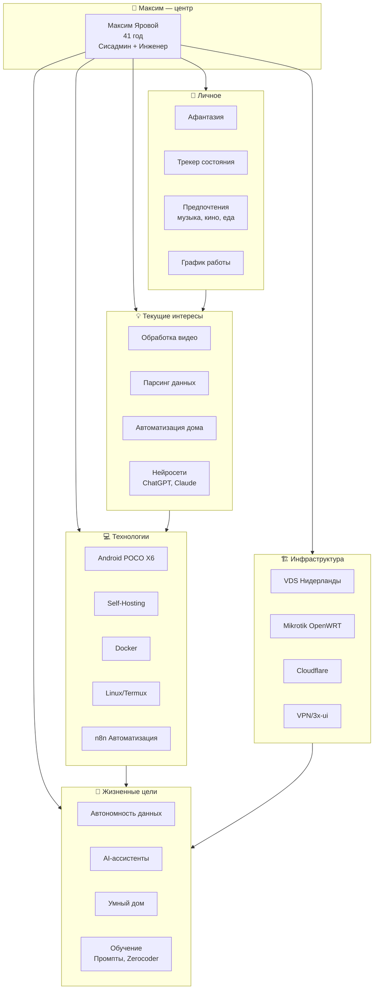

# 🧠 Semantic Knowledge Graph

> Смысловые связи между темами, идеями и интересами из GPT-диалогов

---

## 🎯 Структура графа



---

## 📊 Большие узлы графа (центральные темы)

| Узел | Сила связи | Описание |
|------|-----------|----------|
| **🤖 AI & Автоматизация** | ⭐⭐⭐⭐⭐ | Центральная тема всех диалогов |
| **🏠 Self-Hosting** | ⭐⭐⭐⭐⭐ | Философия: свои сервера, свои данные |
| **📱 Android как центр** | ⭐⭐⭐⭐⭐ | POCO X6 управляет всем |
| **🔗 n8n workflows** | ⭐⭐⭐⭐ | Главный инструмент автоматизации |
| **🧠 Промпт-инжиниринг** | ⭐⭐⭐⭐ | Обучение, Zerocoder университет |

---

## 🗂️ Кластеры знаний

### Кластер 1: 🏠 Дом & Жизнь
```
🧠 Афантазия ──────┐
                  ├─→ 👤 Интроспекция ──→ 📊 Трекер дня
🎵 Предпочтения ───┘                          │
                                              ↓
                                         🎯 Самопознание
```

### Кластер 2: ⚙️ Техническая автономия
```
🐳 Docker ───────┐
📱 Android ──────┼─→ 🏠 Self-Hosting ──→ 🔒 Контроль данных
🌍 VDS ──────────┘         │
                           ↓
                    🤖 AI на своих серверах
```

### Кластер 3: 🎯 Проекты в работе
```
🏡 Умный дом ─────────────┐
                          ├──→ 🔧 Инженерные задачи
🌐 Cloudflare + DNS ──────┤          │
                          ├──────────┘
📊 Парсинг данных ────────┘          ↓
                               🚀 Автоматизация рутины
```

---

## 🔗 Связи между темами

### Сильные связи (тесно связаны)
| Тема A | Тема B | Связь |
|--------|--------|-------|
| 🤖 AI | 📝 Промпты | Обучение созданию запросов |
| 📱 POCO | 🐧 Linux/Termux | Телефон как Linux-девайс |
| 🏠 Дом | 🌍 VDS | Доступ из дома к облаку |
| ⏰ Трекер | 💼 Работа | Мониторинг состояния на работе |
| 🔐 VPN | 🌐 Cloudflare | Безопасный доступ |

### Слабые связи (потенциал развития)
| Тема A | Тема B | Потенциал |
|--------|--------|-----------|
| 🎵 Музыка | 🤖 AI | AI DJ? |
| 🎬 Видео | 🐳 Docker | Видео-процессинг в контейнерах? |
| 🍳 Еда | ⚙️ Автоматизация | Умная кухня? |
| 🎮 Игры | 📱 POCO | Мобильный гейминг? |

---

## 🎨 Mood Board: Интересы Максима

```
┌─────────────────────────────────────────────────────────────┐
│                      🎯 ЦЕНТР: МАКСИМ                     │
├──────────────┬──────────────┬──────────────┬────────────────┤
│   🏠 ДОМ     │   💻 ТЕХ     │   🧠 РАЗВ    │   ⚙️ РАБОТА    │
├──────────────┼──────────────┼──────────────┼────────────────┤
│ • Дача/Город │ • Android    │ • Промпты   │ • Сисадмин    │
│ • Умный дом │ • Docker     │ • AI        │ • Завод       │
│ • Сети/VPN  │ • Linux      │ • Zerocoder │ • Автоматизация│
│ • Asus T300 │ • n8n        │ • Обучение  │ • Трекер дня  │
├──────────────┼──────────────┼──────────────┼────────────────┤
│   🎨 ЛИЧН    │   🔧 ИНСТР   │   🌐 СЕТЬ    │   📚 ПРОЧ     │
├──────────────┼──────────────┼──────────────┼────────────────┤
│ • Афантазия │ • Termux     │ • Cloudflare│ • YouTube     │
│ • Состояние │ • Termius    │ • VDS       │ • Парсинг     │
│ • Предпочт-я│ • VS Code    │ • VPN       │ • Домены      │
│ • График    │ • Obsidian   │ • Mikrotik  │ • Self-host   │
└──────────────┴──────────────┴──────────────┴────────────────┘
```

---

## 📍 Навигация по графу

### По тегам:
- `#personal` → Личное: [[Personal-Cluster]]
- `#tech` → Технологии: [[Tech-Cluster]]
- `#home` → Дом: [[Home-Cluster]]
- `#automation` → Автоматизация: [[Automation-Cluster]]
- `#learning` → Обучение: [[Learning-Cluster]]

### По типу связи:
- [[Strong-Links]] - Тесно связанные темы
- [[Weak-Links]] - Потенциальные связи
- [[Projects-Active]] - Активные проекты

---

*Создано: 2026-02-15 | База: 36 GPT-диалогов*