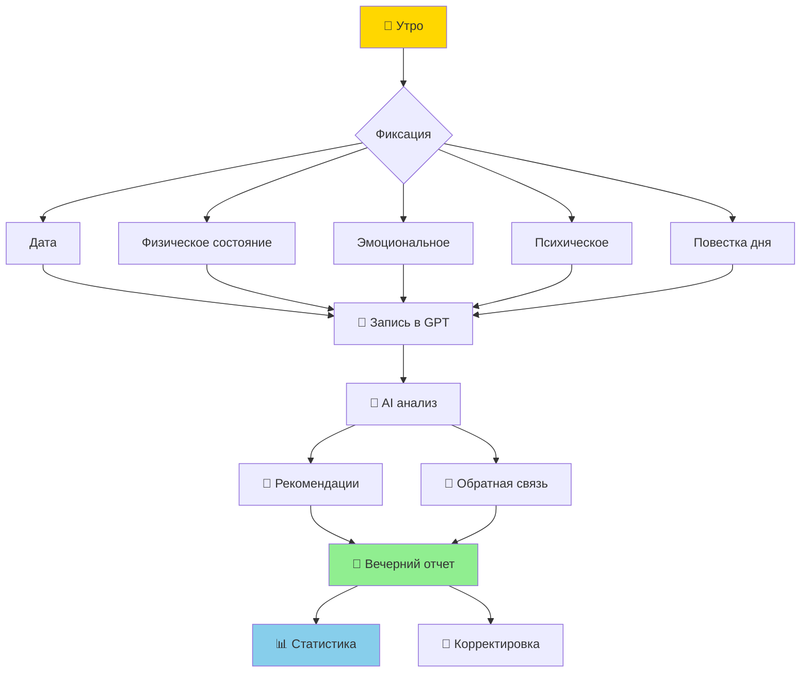

# 👤 Personal Cluster: Личное

> Темы из GPT-диалогов: кто я, как я работаю, что люблю

---

## 🧠 Афантазия

```mermaid
mindmap
  root((Афантазия))
    Определение
      Отсутствие мысленных образов
      Не влияет на память
      Не влияет на воображение
      Не влияет на интеллект
    Характеристики
      Обычное явление
      2-4% населения
      Не болезнь
      Просто особенность
    Влияние
      Восприятие информации
      Общение
      Понимание абстракций
    Связи
      [[Learning-Cluster]] Обучение по-другому
      [[Tech-Cluster]] Текстовые интерфейсы
```

**Из диалогов:**
> "Я не могу создавать мысленные образы, но это не влияет на способность к запоминанию и воображению..."

**Связанные заметки:**
- [[Personal/2024-12-26_676d978b]]
- [[People/Максим Яровой/Profile-Current-State]]

---

## 📊 Трекер состояния дня



**Из диалогов:**
> "Ты сообщаешь дату, состояние, повестку. Я фиксирую и даю рекомендации. Вечером - отчет."

**Компоненты:**
- ✅ Физическое состояние (энергия, самочувствие)
- ✅ Эмоциональное (настроение, стресс)
- ✅ Психическое (фокус, усталость)
- ✅ Повестка (задачи, приоритеты)
- ✅ События (значимые моменты)

**Связи:**
- [[Work-Cluster]] → График работы
- [[Personal/2025-01-01_67755f28]] → Исходный диалог

---

## 💼 График работы

```mermaid
journey
    title График работы Максима (циклический)
    section Тип А: Завод
      День 1: 5: Завод
      День 2: 5: Завод
    section Перерыв
      День 3: 3: Выходные
      День 4: 3: Выходные
    section Тип Б: Сисадмин
      День 5: 5: Сисадмин
      День 6: 5: Сисадмин
    section Перерыв
      День 7: 3: Выходные
      День 8: 3: Выходные
```

**Из диалогов:**
> "4 января завод, 5-7 выходные, 8-9 завод, 10-11 системный администратор..."

**Паттерны:**
- 🔧 **На заводе:** Мало времени, только краткие задачи
- 💻 **Сисадмин:** Больше времени, можно глубокие проекты
- 🤖 **Доступ к GPT:** Больше во время сисадминских смен

**Связи:**
- [[Automation-Cluster]] → Автоматизация рутины
- [[Projects-Active]] → Текущие задачи

---

## 🎭 Предпочтения и интересы

```mermaid
graph LR
    subgraph ВОПРОСЫ["🎲 AI будет спрашивать:"]
        Q1[Музыка каких жанров?]
        Q2[Любимые фильмы?]
        Q3[Сериалы рекомендовать?]
        Q4[Какая еда?]
        Q5[Хобби?
    end
    subgraph ЦЕЛЬ["🎯 Цель:"]
        G1[Запомнить предпочтения]
        G2[Лучше понять Максима]
        G3[Улучшить рекомендации]
        G4[Построить профиль]
    end
    
    Q1 --> G1
    Q2 --> G2
    Q3 --> G3
    Q4 --> G4
    Q5 --> G1
```

**Из диалогов:**
> "Если мы обсуждаем что-то не по работе, можешь задавать вопросы о музыке, кино, сериалах, еде..."

**Метод:**
- Небольшие тесты (5 минут)
- Разные темы
- Сбор профиля предпочтений
- Обновление трекера состояния

---

## 🔗 Cross-Cluster Links

```mermaid
graph TD
    subgraph PERSONAL["👤 Personal"]
        P1[Афантазия]
        P2[Трекер дня]
        P3[Предпочтения]
        P4[График работы]
    end
    
    subgraph TECH["💻 Tech"]
        T1[Текстовые интерфейсы]
        T2[Android]
        T3[AI-ассистенты]
    end
    
    subgraph PROJECTS["🎯 Projects"]
        PR1[Self-hosting]
        PR2[Умный дом
    end
    
    P1 -->|текст > образы| T1
    P2 -->|телефон| T2
    P3 -->|AI знает| T3
    P4 -->|время на| PR1
    P2 -->|контроль| PR2
```

---

## 📋 Профиль личности (из диалогов)

```yaml
Имя: Максим (Макс)
Возраст: 41 год
Профессия: Инженер-технолог общепита → Сисадмин
Опыт IT: 10+ лет

Особенности:
  - Афантазия
  - Визуал: слабый
  - Текст/структуры: сильный
  
Рабочий стиль:
  - Чередование контекстов (завод/сисадмин)
  - Нужна автоматизация рутины
  - Любит структуры и отслеживание

Коммуникация:
  - Telegram
  - Текстовые интерфейсы
  - AI-ассистенты как помощники

Ценности:
  - Автономность
  - Контроль данных
  - Обучение
  - Эффективность
```

---

*Кластер Personal | Создано из диалогов 2024-12-26 — 2025-01-04*