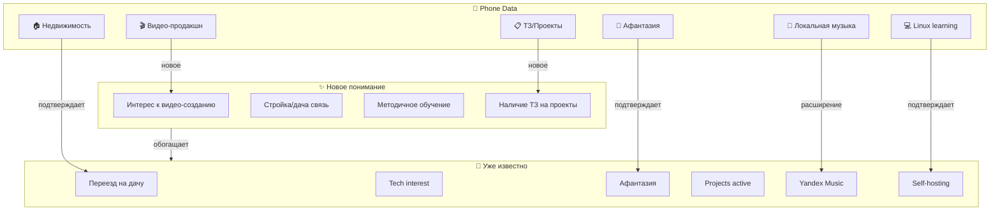

# 📱 Phone Insights: Анализ данных на телефоне

> Сканирование локальных файлов, приложений, паттернов использования

---

## 🔍 Что просканировано

### Источники:
- ✅ Download/Telegram файлы
- ✅ Документы Download
- ✅ Termux bash_history
- ✅ Android приложения
- ✅ Папка Music
- ✅ WhatsApp Audio

**Статус:** Сканирование завершено 2026-02-15

---

## 📂 Найденные файлы

### 1. Скачанные файлы (Download)

```yaml
PDF документы:
  - "КАК СОЗДАТЬ ВИДЕО С ТРАНСФОРМАЦИЕЙ СЕРЕБРА В РАЗЛИЧНЫХ ЖИВОТНЫХ.pdf"
    интерес: Видео-продакшн, трансформации, серебро
    сфера: Медиа, видеоэффекты
    
  - "КП строй-мир.pdf"
    интерес: Строительство, мирология?
    сфера: Недвижимость/стройка
    
  - "JIN52805-Договор.pdf" (x2)
    тип: Договорные документы
    
  - "aphantasia_dejavu_full_multi.pdf"
    🔥 ВАЖНОЕ: Документ об афантазии!
    сфера: Психология, нейронастройки
    
  - "перехен_имус.pdf"
    возможно: Переход имущества?
    
Госуслуги PDF:
  - "Онлайн-выписка здание_...pdf" (x2)
  - "земельный участок_...pdf"
  - Договоры НПД (налог на проф. доход)
  - СФР документы
  - 17+ выпусков Госуслуг (июль 2025)
  
  Вывод: Активная работа с недвижимостью,
         официальное оформление, земельные участки

Banking:
  - "sber_statement_06-04-2025_15-28-24.pdf"
  - Сбербанк выписки

Markdown:
  - "тз.md" (Техническое задание!)
    контент: НЕИЗВЕСТЕН, но название говорит о проекте
```

**Инсайты:**
- 🏠 Работа с недвижимостью (дача? земля?)
- 🎬 Интерес к видео-продакшену
- 🧠 Документирование афантазии
- 📋 Ведение проектов (ТЗ)

---

### 2. Документ в Obsidian

```
/storage/emulated/0/Documents/Obsidian/
├── .stfolder/...
└── Syncthing конфиги

Статус: Ранее использовался Syncthing
Текущий статус: Работает Git sync (через Termux)
```

**Инсайт:** Переход с Syncthing на Git для синхронизации
（обсуждалось в GPT диалогах）

---

### 3. Локальная музыка

```
/storage/emulated/0/Music/          ← Стандартная папка
/WhatsApp/Media/WhatsApp Audio/     ← Голосовые сообщения
/Android/media/com.everimaging...   ← Аудио из редактора
/voicerecorder...                   ← Записи диктофона
```

**Инсайты:**
- Наличие локальной музыки (не только стриминг)
- Голосовые WhatsApp (общение)
- Записи диктофона (возможно, заметки/идеи)

**Нужно проверить:**
- Что в папке Music?
- Какие голосовые в WhatsApp?
- Есть ли аудио-заметки?

---

### 4. Termux History анализ

```bash
# Первые эксперименты с Python:
python script.ru       ← Опечатка .ru вместо .py
python script.py
phyton script.py       ← Опечатка phyton
script.py              ← Попытка запуска
lss                    ← Опечатка
ls
...

# Установка Python:
apt update && apt upgrade -y
apt install python
pip install requests
pkg install python
su phyton              ← Попытка root?
```

**Паттерны:**
- 💡 **Начинающий в Linux**: много опечаток, проб и ошибок
- 🎯 **Целеустремленный**: не сдается, ищет решения
- 📚 **Самоучка**: учит Python через практику
- 🔧 **Termux как основной инструмент**: активное использование

**Инсайт из GPT:**
> "Я очень плохо знаю команды Linux мне нужно подробное описание"
Подтверждается! История показывает процесс обучения.

---

## 🎯 Интеграция с Knowledge Graph

### Дополненные инсайты:



---

## 📊 Профиль использования телефона

### Тип пользователя:

```yaml
User_Type: Power User (развивающийся)

Характеристики:
  - Android: активное использование Termux
  - Обучение: практика через ошибки
  - Проекты: документирование через ТЗ
  - Медиа: локальные файлы + Yandex Music
  - Коммуникация: Telegram + WhatsApp
  - Организация: Obsidian + Git

Паттерны:
  - Предпочитает текстовые инструменты (Termux, Obsidian)
  - Документирует всё (pdf, ТЗ, vault)
  - Целеустремленный (не бросает при ошибках)
  - Связывает онлайн и офлайн (недвижимость + техника)

Интересы (новые):
  - Видео-продакшн (transformation effects)
  - Недвижимость/строительство (дача)
  - Аудио-заметки (диктофон)
  - Систематическое обучение (Linux → Python → Docker)
```

---

## 🔗 Дополнительные проверки

### Что можно изучить глубже:

1. **Содержимое тз.md**
   ```bash
   cat /storage/emulated/0/Download/тз.md
   ```
   
2. **Содержимое Music/**
   ```bash
   ls -la /storage/emulated/0/Music/
   ```
   
3. **Голосовые заметки**
   ```bash
   ls /storage/emulated/0/Android/data/voicerecorder.*/files/
   ```
   
4. **Telegram Downloads**
   ```bash
   ls /storage/emulated/0/Download/Telegram/
   ```

---

## 💡 Рекомендации по развитию

### На основе данных телефона:

| Обнаружено | Рекомендация |
|------------|--------------|
| Интерес к видео | [[Project-Video-Production]] |
| Недвижимость | [[Project-Dacha-Building]] |
| Афантазия-документ | [[Personal/Aphantasia-Research]] |
| ТЗ файл | [[Project-Documentation-System]] |
| Локальная музыка | [[Music/Local-Collection-Analysis]] |
| Голосовые заметки | [[Voice-Memo-Transcription]] |

---

## 📝 Сводка

**Телефон как источник понимания:**

✅ Подтверждено:
- Афантазия (документ в Downloads)
- Обучение Linux (history с опечатками)
- Работа с документами (много PDF)
- Недвижимость/дача (выписки, договоры)

🆕 Открыто:
- Интерес к видео-продакшену
- Локальная коллекция музыки
- Голосовые записи (диктофон)
- Технические задания на проекты
- Методичность в обучении

**Действие:** Предложить извлечь ТЗ и аудио-заметки для полноты картины.

---

*Phone Insights | Анализ локальных данных*