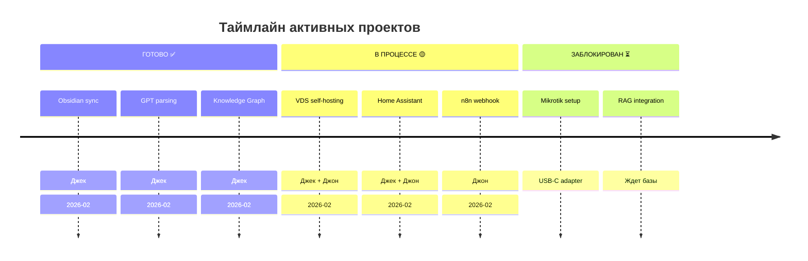
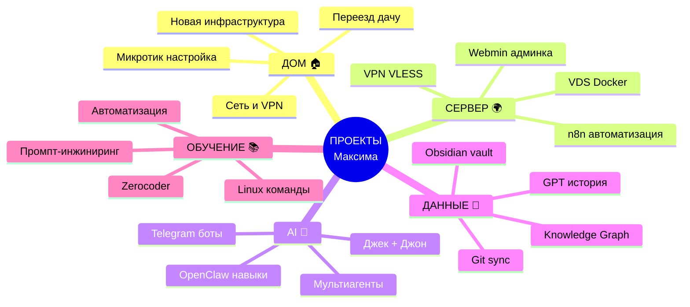
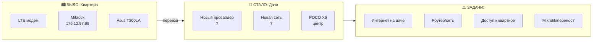
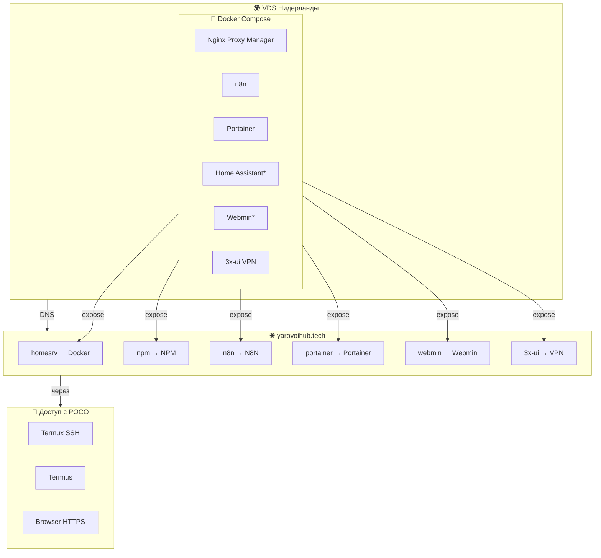
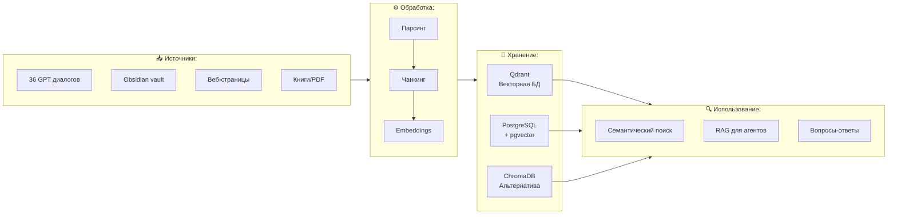
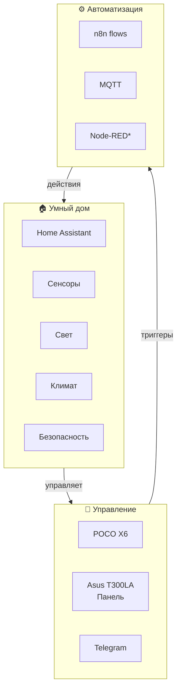
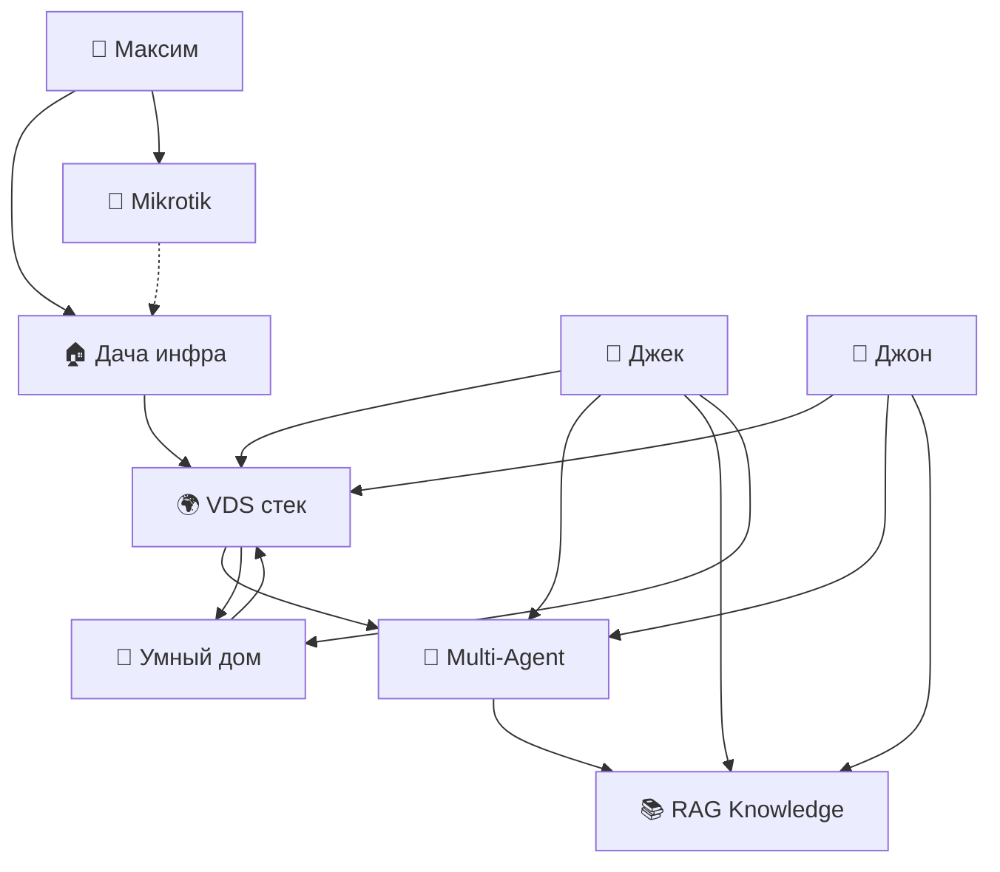

# 🎯 Projects: Активные проекты

> Текущие задачи и цели из GPT-диалогов

---

## 📋 Project Dashboard



---

## Пространство проектов (Mind Map)



---

## 🏠 PROJECT-001: Переезд на дачу



**Статус:** 🟡 В процессе  
**Приоритет:** ВЫСОКИЙ  
**Блокеры:** Неизвестна инфраструктура

**Задачи:**
- [ ] Определить интернет-провайдера
- [ ] Настроить локальную сеть
- [ ] Решить судьбу Mikrotik
- [ ] Организовать доступ к квартире

**Связи:**
- [[Tech-Cluster]] → Сетевые технологии
- [[Personal/2025-01-01_67745b75]] → Cloudflare настройки

---

## 🌍 PROJECT-002: VDS Self-Hosting Stack



**Статус:** 🟡 В процессе  
**Приоритет:** ВЫСОКИЙ

**Уже работает:**
- ✅ Docker установлен
- ✅ Nginx Proxy Manager
- ✅ Домены настроены

**В процессе:**
- 🟡 n8n workflows
- 🟡 Home Assistant
- 🟡 VPN 3x-ui

**Связи:**
- [[Tech-Cluster]] → Self-Hosting философия
- [[../../Projects/RAG-GPT-Integration/README]] → Базы данных

---

## 🤖 PROJECT-003: Multi-Agent System

```mermaid
flowchart TB
    subgraph USERS["👤 Пользователи"]
        U1[Максим]
        U2[Александр?]
    end
    
    subgraph AGENTS["🤖 Агенты"]
        A1[Джек<br/>Android POCO<br/>OpenClaw]
        A2[Джон<br/>Windows PC<br/>n8n]
        A3[?]<br/>Future]
    end
    
    subgraph INTERFACE["💬 Интерфейс"]
        I1[Telegram]
        I2[Obsidian Shared]
        I3[n8n Webhooks]
    end
    
    subgraph BACKEND["⚙️ Backend"]
        B1[VDS Docker]
        B2[GitHub Sync]
        B3[LLM APIs]
    end
    
    USERS -->|управляет| AGENTS
    AGENTS -->|общаются через| INTERFACE
    AGENTS -->|используют| BACKEND
    
    A1 <-->|Obsidian| I2
    A2 <-->|Telegram| I1
    A1 <-->|Webhook| I3
    A2 <-->|Webhook| I3
    
    I2 -->|Git| B2
    I3 -->|HTTP| B1
    A1 -->|API| B3
    A2 -->|API| B3
```

**Статус:** 🟡 В процессе  
**Приоритет:** ВЫСОКИЙ

**Архитектура:**
- Джек: Android, OpenClaw, Termux
- Джон: Windows, n8n, localhost:5678
- Связь: Obsidian Shared + Git + Webhooks

**Блокер:**
- ⏳ n8n webhook 400 ошибка (настройка пути)

**Связи:**
- [[Tech-Cluster/n8n]] → Автоматизация
- [[../Shared/jack/2026-02-15-gpt-analysis-complete]] → Уведомление Джону

---

## 📚 PROJECT-004: Knowledge Base & RAG



**Статус:** ⏳ Заблокирован  
**Приоритет:** СРЕДНИЙ

**Зависимости:**
- PostgreSQL + pgvector
- Qdrant или ChromaDB
- n8n для пайплайнов

**Связи:**
- [[../../Projects/RAG-GPT-Integration/README]] → Полный план
- [[../GPT-Conversations/10-Mindmap-GPT-Analysis]] → Источник данных

---

## ⚙️ PROJECT-005: Домашняя автоматизация



**Статус:** 🟡 Планирование  
**Приоритет:** СРЕДНИЙ

**Оборудование:**
- Панель: Asus Transformer Book T300LA
- План: Home Assistant + n8n

**Связи:**
- [[People/Максим Яровой/Infrastructure-Evolution]] → Схема дачи
- [[Equipment/2024-12-28_676f9f07]] → Оборудование

---

## 📊 Сводная таблица проектов

| ID | Проект | Статус | Приоритет | Блокер | Ответственный |
|----|--------|--------|-----------|--------|---------------|
| P001 | Переезд на дачу | 🟡 | Высокий | Инфра неизвестна | Максим + Джек |
| P002 | VDS Self-Hosting | 🟡 | Высокий | Настройка | Джек + Джон |
| P003 | Multi-Agent | 🟡 | Высокий | Webhook 400 | Джон |
| P004 | RAG Knowledge | ⏳ | Средний | Базы данных | Джек + Джон |
| P005 | Умный дом | 🟡 | Средний | Оборудование | Джек |
| P006 | Mikrotik config | ⏳ | Средний | USB-C адаптер | Максим |

---

## 🔗 Связи проектов



---

*Projects Dashboard | Статус на 2026-02-15*