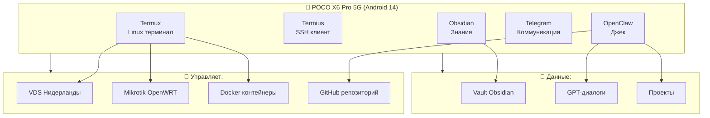
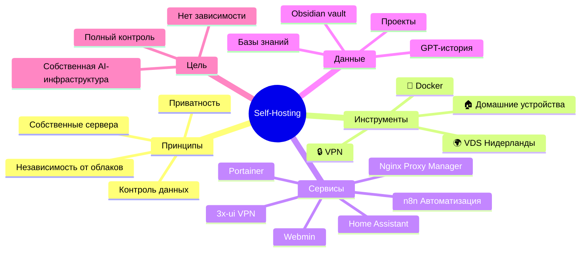
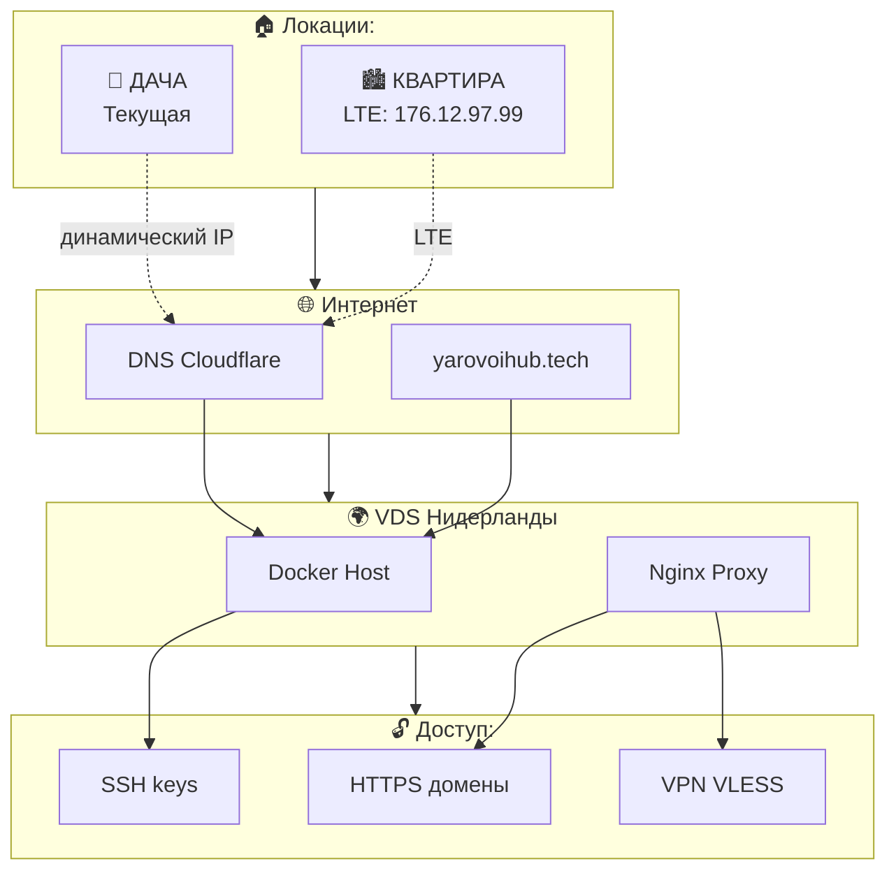
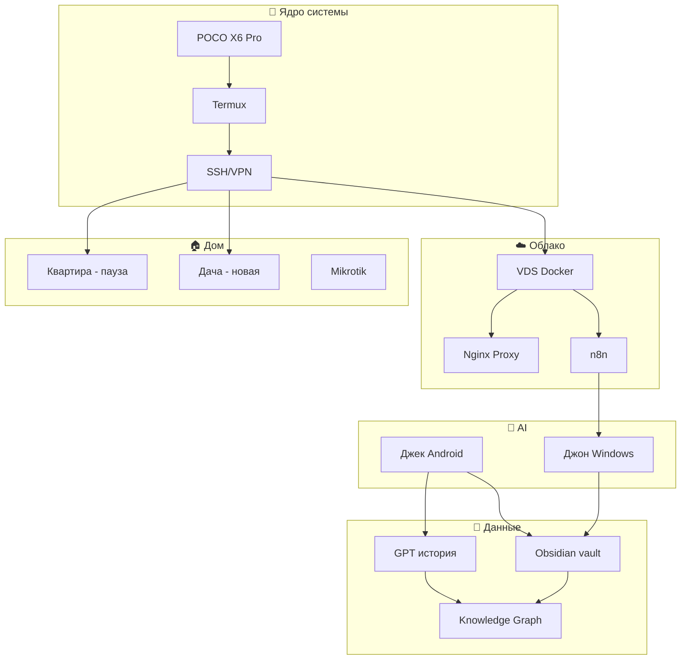

# 💻 Tech Cluster: Технологии

> Все технические темы из GPT-диалогов: инструменты, платформы, архитектура

---

## 📱 POCO X6 Pro 5G — Центр управления



**Из диалогов:**
> "Настройка будет по SSH через Termux и Termius..."
> "POCO X6 Pro 5G с двумя SIM..."

**Роль:**
- 🎮 **Пульт управления** всеми системами
- 🐧 **Linux-устройство** (Termux)
- 🤖 **Центр AI-агентов** (OpenClaw)

---

## 🐳 Self-Hosting Философия



**Из диалогов:**
> "VDS сервер в Нидерландах для self-hosting..."
> "Docker-стек: Home Assistant, n8n, всё своё..."

**Сервисы на VDS:**
| Сервис | Домен | Назначение |
|--------|-------|------------|
| homesrv | homesrv.yarovoihub.tech | Главный сервер |
| npm | npm.yarovoihub.tech | Обратный прокси |
| n8n | n8n.yarovoihub.tech | Автоматизация (Джон) |
| portainer | portainer.yarovoihub.tech | Docker управление |
| webmin | webmin.yarovoihub.tech | Системная админка |
| 3x-ui | 3x-ui.yarovoihub.tech | VPN VLESS |

---

## ⚙️ n8n — Сердце автоматизации

```mermaid
flowchart LR
    subgraph SOURCES["📥 Источники данных:"]
        S1[Gemphonebot<br/>Джон]
        S2[OpenClaw<br/>Джек]
        S3[Telegram]
        S4[GitHub]
        S5[Obsidian vault]
    end
    
    subgraph N8N["⚙️ n8n Workflows"]
        W1[Получение]
        W2[Обработка]
        W3[Маршрутизация]
        W4[Действие]
    end
    
    subgraph DEST["📤 Действия:"]
        D1[Telegram уведомления]
        D2[Git commit]
        D3[Webhook
        D4[Базы данных]
    end
    
    SOURCES --> N8N
    S1 --> W1
    S2 --> W1
    S3 --> W1
    S4 --> W1
    S5 --> W1
    
    N8N --> DEST
    W4 --> D1
    W4 --> D2
    W4 --> D3
    W4 --> D4
```

**Из диалогов:**
> "n8n webhook для связи агентов..."
> "ngrok для тестирования webhook..."

**Архитектура:**
- Джон (Windows) → n8n на localhost:5678
- Джек (Android) → webhook URL
- Связь через webhook flows
- Telegram как интерфейс

---

## 🐧 Linux & Termux

```mermaid
graph TB
    subgraph ANDROID["📱 Android POCO"]
        A1[Termux App]
        A2[n8n CLI]
        A3[Docker]*
    end
    
    subgraph COMMANDS["🔧 Команды (Макс учит)"]
        C1[ssh user@host]
        C2[docker ps]
        C3[git push/pull]
        C4[cd, ls, pwd]
        C5[nano/vim]
    end
    
    subgraph TOOLS["🛠️ Инструменты"]
        T1[Termius]
        T2[OpenClaw]
        T3[Obsidian Git]
    end
    
    ANDROID --> COMMANDS
    A1 --> C1
    A1 --> C2
    A1 --> C3
    
    COMMANDS --> TOOLS
    C1 --> T1
    C3 --> T2
    C3 --> T3
```

**Из диалогов:**
> "Я очень плохо знаю команды Linux, мне нужно подробное описание..."
> "Настройка через Termux и Termius..."

**Learning curve:**
- ❌ Слабые знания Linux
- ✅ PowerShell опыт есть
- 🎯 Нужны подробные объяснения каждой команды
- 📚 Doc-страницы с примерами

---

## 🌐 Cloudflare & Сеть



**Из диалогов:**
> "Запомни IP Mikrotik: 176.12.97.99"
> "DNS записи через @ для root..."

**DNS Конфигурация:**
```yaml
A записи:
  @: VDS_IP
  homesrv: VDS_IP
  npm: VDS_IP
  n8n: VDS_IP
  portainer: VDS_IP
  webmin: VDS_IP
  3x-ui: VDS_IP

CNAME:
  www: @
```

---

## 🔗 Интеграция компонентов



---

## 💻 Технологический стек (из диалогов)

```yaml
Устройства:
  Телефон: POCO X6 Pro 5G, Android 14
  Планшет: Asus Transformer Book T300LA
  Роутер: Mikrotik OpenWRT (в квартире)
  
Облако:
  VDS: Timeweb, Нидерланды
  IP: 194.87.85.232 / 195.201.96.34
  OS: Ubuntu (proot)
  
Контейнеры:
  Platform: Docker
  Orchestration: Portainer
  Reverse Proxy: Nginx Proxy Manager
  
Автоматизация:
  Engine: n8n
  Location: Windows (Джон) + VDS
  Connectors: Webhook, Telegram, Git, SSH
  
Хранилище:
  Knowledge: Obsidian
  Sync: Git (GitHub)
  Backup: Local + Cloud
  
AI:
  Джек: OpenClaw Android
  Джон: n8n + API
  Backup: ChatGPT история
```

---

*Кластер Tech | Создано из диалогов про Self-Hosting, Docker, n8n*