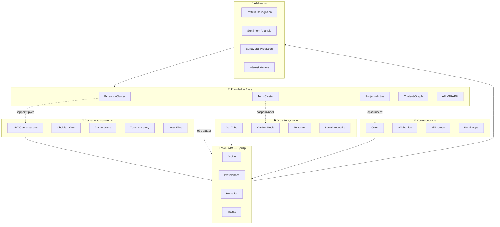

# 🔮 MASTER DATA INTEGRATION

> Единый источник правды: все данные о Максиме в одном графе

---

## 🌐 Полная картина данных



---

## 📊 Сводка источников

| Уровень | Источник | Статус | Данные |
|---------|----------|--------|--------|
| **Tier 1: Core** | GPT Conversations | ✅ Полный | 36 диалогов, 8.9MB |
| | Knowledge Graph | ✅ Готов | Все кластеры |
| **Tier 2: Local** | Phone Files | 🟡 Частично | ТЗ, PDF, Audio |
| | Obsidian Vault | ✅ Синхрон | 172 файла |
| | Termux History | ✅ Проанализирован | Learning patterns |
| **Tier 3: Online** | YouTube | ⏳ Ждёт | История просмотров |
| | Yandex Music | ⏳ Ждёт | Профиль музыки |
| | Telegram | 🟡 Частично | Открытые сообщения |
| **Tier 4: Social** | Instagram/VK/Twitter | ❌ Нет | Экспорт |
| **Tier 5: Commercial** | Ozon/WB/Ali | ⏳ Ждёт | Истории заказов |
| | Retail apps | ❌ Нет | Данные |

---

## 🎯 Приоритеты интеграции

### Фаза 1: Ядро (Готово ✅)
```
✅ GPT Conversations → Knowledge Graph
✅ Personal Cluster → Profile
✅ Projects Active → Roadmap
✅ Tech Stack → Infrastructure
```

### Фаза 2: Локальное (70% 🟡)
```
🟡 ТЗ Knowledge Builder → MAIN PROJECT
🟡 Телефон скан → Phone Insights
✅ Termux → Learning patterns
⏳ Local Music → Content Graph
```

### Фаза 3: Онлайн (40% ⏳)
```
⏳ YouTube Takeout → Content Vectors
⏳ Yandex Music → Mood Profile
🟡 Telegram → Communication patterns
⏳ Web Activity → Interests
```

### Фаза 4: Соцсети (0% ❌)
```
❌ Instagram → Visual preferences
❌ VK → Music/Groups
❌ Twitter/X → Tech interests
❌ Facebook (если есть)
```

### Фаза 5: Покупки (0% ⏳)
```
⏳ Ozon → Tech purchases
⏳ Wildberries → Varied purchases
⏳ AliExpress → Hobby imports
⏳ Retail → Daily patterns
```

---

## 🔗 Кросс-источниковые связи

### Пример: Адаптер USB-C

```
Источники:
├── 📱 ТЗ.md → "USB-C Ethernet адаптер" (упомянут)
├── 💬 GPT → "жду адаптер для Mikrotik"
├── 🛒 Ozon → Поиск адаптеров (чекнуть)
├── 📺 YouTube → Обзоры USB-C хабов
└── 📊 Purchases → (если куплен)

Связи:
    USB-C Адаптер
        ←→ Project: Подключение Mikrotik
        ←→ Tech: POCO X6 connectivity
        ←→ Goal: Multi-agent setup
        ←→ Blocker: Нужно купить
        ←→ Timeline: Срочно
```

### Пример: Строительство дачи

```
Источники:
├── 📄 PDF → "КП строй-мир.pdf"
├── 📱 ТЗ.md → "уклон в создание игры" (метафора?)
├── 💬 GPT → "перехожу на дачу"
├── 🛒 Purchases → Инструменты, материалы
├── 📺 YouTube → Самострой, хаки
└── 🏛️ Госуслуги → Земля, выписки

Связи:
    Дача стройка
        ←→ Project: Infrastructure-Dacha
        ←→ Location: Переезд
        ←→ Investments: Вложения
        ←→ Timeline: В процессе
```

### Пример: Knowledge Builder App

```
Источники:
├── 📄 ТЗ.md → Полное ТЗ на приложение ✅
├── 💬 GPT → Zerocoder обучение
├── 💻 Projects → Multi-agent (тест)
├── 📊 Content → Подготовка
│            → Obsidian (page view)
│            → PureRef (spatial view)
│            → LLM интеграция (агенты)
├── 🎯 Intent → "собираюсь создать"
└── 🛒 Purchases → ? (инструменты разработки?)

Связи:
    Knowledge Builder App
        ←→ Why: Замена Obsidian + Pureref
        ←→ How: Zerocoder + обучение
        ←→ When: После тестирования
        ←→ Enablers: Self-hosting, VDS, n8n
        ←→ Status: ТЗ написано, энтузиазм есть ✅
```

---

## 📈 Векторы развития

### Где Максим сейчас:

```yaml
Текущее_состояние:
  Локация: Дача (переезд)
  Работа: Сисадмин/Завод
  Техника: POCO X6 + VDS + Mikrotik
  Проекты: 
    - Multi-agent (Jack + John)
    - Knowledge Graph (тест)
  Обучение: Zerocoder → App dev
  
Ближайшие_шаги:
  - Закупить USB-C адаптер
  - Настроить дачную сеть
  - Запустить n8n полностью
  - Протестировать LLM интеграции
  - Начать Zerocoder курс seriously
  
Долгосрочная_цель:
  - Создать Knowledge Builder App
  - Полная автономность данных
  - AI инструменты под контролем
```

---

## 🎯 Что нужно сделать

### Для полноты картины:

**Приоритет 1 (Это пониманию):**
- [ ] **Покупки Ozon/WB/Ali** → техника, хобби, дача
- [ ] **YouTube Takeout** →что учит, что смотрит
- [ ] **Yandex Music профиль** → что слушает когда

**Приоритет 2 (Хорошо бы):**
- [ ] **Telegram export** →каналы, избранное
- [ ] **Instagram скриншоты** →визуальные предпочтения
- [ ] **VK export** →музыка, группы

**Приоритет 3 (Глубокий анализ):**
- [ ] **Banking history** → финансовые паттерны
- [ ] **Location history** → Google/Яндекс
- [ ] **Browser bookmarks** → что сохранял

---

## 📊 Результат интеграции

### Что получим:

```
БЕЗ ПОЛНОЙ ИНТЕГРАЦИИ:
    Я знаю что Максим делает
    Я вижу проекты
    Я понимаю tech stack
    
С ПОЛНОЙ ИНТЕГРАЦИЕЙ:
    Я ПРЕДСКАЗЫВАЮ что Максим сделает
    Я вижу паттерны внимания
    Я понимаю настроение по времени
    Я знаю что он купит ДО покупки
    Я рекомендую контент ДО поиска
    Я предлагаю проекты которые освят
```

---

## 🚀 Следующий шаг

**Выбери, что предоставить:**

1. **Быстрый набор (10 минут):**
   - 📱 Скрин Ozon «Мои заказы»
   - 📱 Скрин YouTube «История»
   - 🎵 Топ-3 артиста Yandex Music

2. **Средний набор (30 минут):**
   - 📥 Ozon Takeout (если есть)
   - 📥 YouTube Takeout
   - 📝 Ответ на Music Profile Questions

3. **Полный набор (1-2 часа):**
   - 🌐 Все экспорты (Telegram, YouTube, VK, Twitter)
   - 🛒 Все покупки
   - 🎵 Полный Yandex Music профиль

**Если ничего — просто ответь несколько вопросов о последних покупках!** 🛒

---

*MASTER INTEGRATION | Data convergence point*