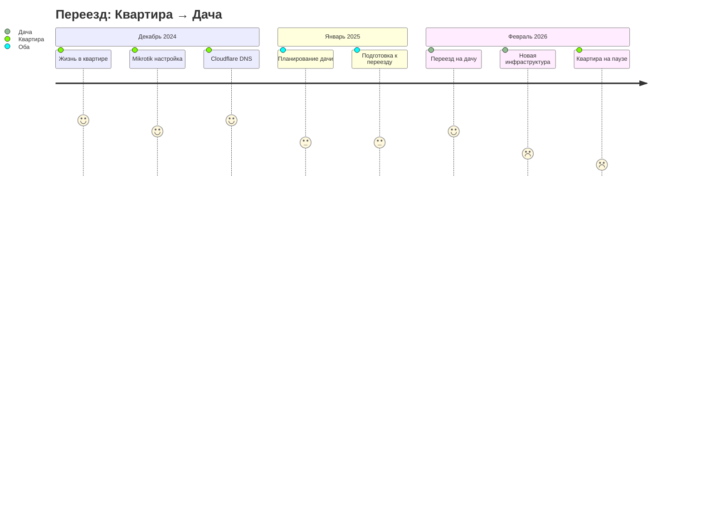

# 🏗️ Эволюция инфраструктуры

## СТАРАЯ → ТЕКУЩАЯ

```mermaid
graph TB
    subgraph ДЕКАБРЬ_2024["📅 Декабрь 2024 - Январь 2025"]
        A[🏙️ КВАРТИРА<br/>LTE + Mikrotik]
        A1[176.12.97.99]
        A2[Asus T300LA<br/>панель умного дома]
    end
    
    subgraph ФЕВРАЛЬ_2026["📅 Февраль 2026"]
        B[🏡 ДАЧА]<-->|новая локация| B1[инфра-?]
        C[🏙️ КВАРТИРА]<-->|пока неактивна| C1[ожидает USB adaper]
        D[🌍 VDS]<-->|стабильно работает| D1[yarovoihub.tech]
    end
    
    subgraph 📱_Центр["📱 POCO X6 Pro 5G"]
        Phone[Android 14<br/>Termux + OpenClaw<br/>Центр управления]
    end
    
    Phone -.->|управляет| A
    Phone -.->|управляет| B
    Phone -.->|управляет| D
    
    A --> A1
    A --> A2
    
    style B fill:#90EE90,stroke:#228B22,stroke-width:4px
    style B1 fill:#FFD700
    style A fill:#D3D3D3
```

---

## 🎯 Текущая карта инфраструктуры

```mermaid
graph TB
    subgraph 📱_МОБИЛЬНЫЙ_ЦЕНТР["📱 POCO X6 Pro 5G<br/>Android 14"]
        P1[OpenClaw - Джек]
        P2[Termux SSH]
        P3[Termius]
        P4[Telegram]
    end
    
    subgraph 🏡_ДАЧА["🏡 ДАЧА<br/>ТЕКУЩАЯ ЛОКАЦИЯ"]
        D1[Инфраструктура<br/>в разработке]
        D2[Новый провайдер?]
        D3[Новая сеть]
        D4[Оборудование?]
    end
    
    subgraph 🏙️_КВАРТИРА["🏙️ КВАРТИРА<br/>ВРЕМЕННО НЕАКТИВНА"]
        K1[Mikrotik<br/>OpenWRT<br/>176.12.97.99]
        K2[Asus T300LA<br/>панель умного дома]
        K3[LTE модем]
    end
    
    subgraph 🌍_VDS["🌍 VDS Timeweb<br/>Нидерланды"]
        V1[194.87.85.232]
        V2[Docker Stack]
        V3[Nginx Proxy]
        V4[n8n - Джон]
        V5[Portainer]
    end
    
    subgraph 🌐_ДОМЕНЫ["🌐 yarovoihub.tech"]
        DNS1[homesrv - дома]
        DNS2[npm - прокси]
        DNS3[n8n - автоматизация]
        DNS4[portainer - docker]
        DNS5[webmin - админка]
        DNS6[3x-ui - vpn]
    end
    
    P1 -.->|управляет| 🏡_ДАЧА
    P1 -.->|управляет| 🏙️_КВАРТИРА
    P1 -.->|управляет| 🌍_VDS
    
    🏡_ДАЧА -.->|доступ из| 🌍_VDS
    🏙️_КВАРТИРА -.->|доступ из| 🌍_VDS
    
    🌍_VDS --> 🌐_ДОМЕНЫ
    
    style 📱_МОБИЛЬНЫЙ_ЦЕНТР fill:#90EE90
    style 🏡_ДАЧА fill:#FFD700
    style 🏙️_КВАРТИРА fill:#D3D3D3
```

---

## 🧩 Развертка по местам

### ДОМАШНИЕ ЛОКАЦИИ (географические)

| Локация | Статус | Интернет | Сетевое | Устройства |
|---------|--------|----------|---------|------------|
| **🏡 ДАЧА** | 🟢 АКТИВНА | Уточняется | TBD | POCO X6 + ? |
| **🏙️ Квартира** | ⏸️ ПАУЗА | LTE модем | Mikrotik | T300LA ждет |

### ОБЛАЧНАЯ ИНФРАСТРУКТУРА

| Сервис | Провайдер | IP/Домен | Статус |
|--------|-----------|----------|--------|
| VDS | Timeweb/aeza | 194.87.85.232 | 🟢 Активен |
| Домен | Cloudflare | yarovoihub.tech | 🟢 Активен |

### УПРАВЛЕНИЕ

```
         ┌─────────────────────────┐
         │   📱 POCO X6 Pro 5G    │
         │    Android 14           │
         │  (Центр управления)    │
         └───────────┬─────────────┘
                     │
    ┌────────────────┼────────────────┐
    │                │                │
    ▼                ▼                ▼
┌───────┐       ┌───────┐       ┌─────────┐
│🏡 ДАЧА│       │🏙️ КВАР│       │🌍 VDS  │
│ жилая │       │резерв │       │ cloud  │
│сейчас │       │ждет   │       │стабилен│
└───────┘       └───────┘       └─────────┘
```

---

## 📍 Карта переезда



---

## ⚡ Точки принятия решений

### Что нужно определить для дачи:

```yaml
Интернет-провайдер:
  status: неизвестен
  options:
    - проводной
    - LTE модем (как в квартире)
    - оптоволокно

Сеть:
  status: не настроена
  needs:
    - роутер (новый или перенести Mikrotik?)
    - подсети/сегментация
    - Wi-Fi

Доступ к квартире:
  status: удаленный через VDS
  method: Tailscale / VPN через VDS

Оборудование:
  current: POCO X6 (всё управление)
  missing:
    - USB-C Ethernet адаптер
    - возможно новый роутер для дачи
    - перенос T300LA?
```

---

## 🔮 Сценарии развития

### Сценарий А: Дача становится основной
```
Дача: Полная инфраструктура (роутер, серверы, автоматизация)
Квартиру: Сдача/продажа или минимум оборудования
VDS: Принимает трафик от дачи
```

### Сценарий Б: Двойная локация
```
Дача: Летняя жизнь, выходные
Квартира: Рабочие дни
Mikrotik: Переносится между локациями
VPN: Соединяет обе сети
```

### Сценарий В: Пока неизвестно
```
Статус: Максим только переехал
Нужно: Уточнить планы на обе локации
```

---

## 🎨 Цветовая схема визуализации

| Цвет | Значение | Локации |
|------|----------|---------|
| **🟢 Зеленый** | Активно, работает | Дача, VDS, POCO |
| **🟡 Желтый** | В процессе, неизвестно | Инфраструктура дачи |
| **⏸️ Серый** | На паузе, неактивно | Квартира |
| **🔴 Красный** | Проблема, требует внимания | USB адаптер |

---

## 🔗 Связанные заметки

- [[Profile-Current-State]] - Полный профиль
- [[Dashboard-Current-State]] - Общий dashboard
- [[../../GPT-Conversations/10-Mindmap-GPT-Analysis]] - Mindmap анализа
- [[../../Projects/RAG-GPT-Integration/README]] - RAG интеграция

---

*Создано: 2026-02-15 | Локация: отображает переезд на ДАЧУ*