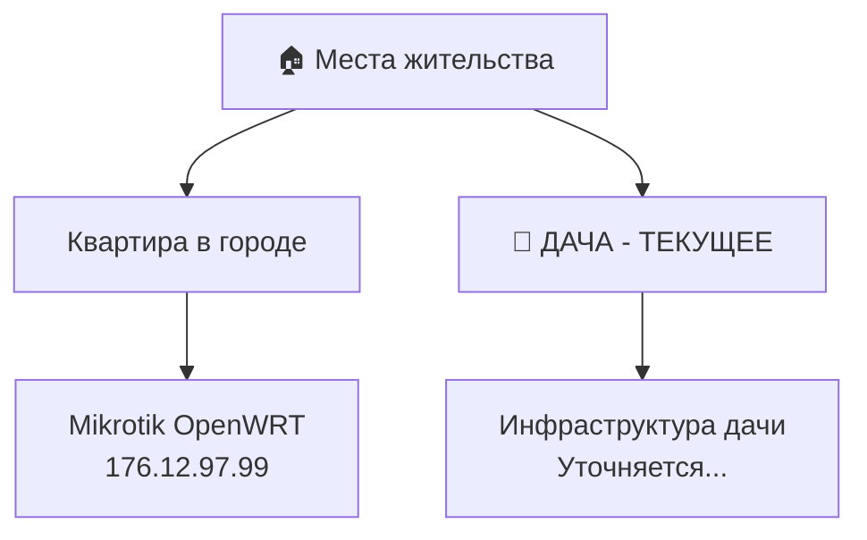

# 👤 Максим Яровой - Текущее состояние

> Последнее обновление: 2026-02-15
> **Текущее местоположение: ДАЧА** 🏡

---

## 📍 Локация



**Статус:** Переехал на дачу. Сейчас нахожусь здесь.

---

## 💼 Работа

| Параметр | Данные |
|----------|--------|
| **Должность** | Системный администратор |
| **Опыт** | 10+ лет в IT |
| **Дополнительно** | Инженер-технолог общепита (профессия) |
| **График** | Чередование: Завод / Системный администратор |
| **Смены** | 2 дня работа, потом выходные |

### График работы (пример)
```
4 января - Завод (1 смена)
5-7 января - Выходные
8-9 января - Завод
10-11 января - Системный администратор
...
```

---

## 🏗️ Инфраструктура

### Оборудование

| Устройство | Спецификация | Роль |
|------------|--------------|------|
| **POCO X6 Pro 5G** | Android 14, 2x SIM | Основное устройство управления |
| **Asus Transformer Book T300LA** | Нетбук + планшет, отсоединяемый экран 13.3" | Панель управления умным домом |
| **Mikrotik** | OpenWRT, IP: 176.12.97.99 | Домашний роутер (в квартире) |
| **USB-C Ethernet адаптер** | Ожидается | Для подключения Mikrotik к POCO |

### 💻 VDS Сервер (Нидерланды)

| Параметр | Значение |
|----------|----------|
| **Провайдер** | Timeweb / aeza.com |
| **IP адрес** | 194.87.85.232 (старый) / 195.201.96.34 |
| **Location** | Нидерланды |
| **Домен** | yarovoihub.tech |

### 🌐 Домены

```yaml
Корневой: yarovoihub.tech
├── homesrv.yarovoihub.tech      # Домашний сервер
├── npm.yarovoihub.tech          # Nginx Proxy Manager
├── n8n.yarovoihub.tech          # n8n автоматизация
├── portainer.yarovoihub.tech    # Portainer Docker
├── webmin.yarovoihub.tech       # Webmin админка
└── 3x-ui.yarovoihub.tech        # VPN VLESS
```

### DNS Провайдер
- **Cloudflare** - управление DNS записями
- DDNS для динамического IP (LTE в квартире, дача)

---

## 🔧 Инструменты доступа

| Инструмент | Назначение |
|------------|------------|
| **Termux** | Android terminal, SSH клиент |
| **Termius** | SSH/SFTP клиент (UI) |
| **Telegram** | Уведомления, интерфейс агентов |
| **Obsidian** | База знаний, vault |
| **n8n** | Автоматизация (webhooks, flows) |

---

## 🎯 Активные задачи

| ID | Задача | Статус | Приоритет |
|----|--------|--------|-----------|
| TASK-001 | Obsidian autosync | ✅ Готово | Высокий |
| TASK-002 | Home Assistant + n8n | 🟡 В процессе | Высокий |
| TASK-003 | Dialog logging | 🟡 В процессе | Средний |
| TASK-004 | Mikrotik настройка | ⏳ USB адаптер | Высокий |
| TASK-005 | RAG GPT Integration | 🟡 В процессе | Средний |
| TASK-006 | VDS self-hosting | 🟡 В процессе | Высокий |

---

## 🧠 О особенностях

### Афантазия
- Неспособность создавать мысленные образы
- Не влияет на память или воображание
- Обычное состояние (~2-4% населения)

### Рабочие предпочтения
- **На заводе:** Мало личного времени, только краткие задачи
- **Как сисадмин:** Больше времени, можно глубокие проекты
- **Вопросы о предпочтениях:** Готов отвечать тесты для трекинга

---

## 📝 Изменения (2026-02-15)

> **⚠️ ВАЖНО:** Переезд на дачу
> - Предыдущая локация: Квартира в городе с Mikrotik
> - Текущая локация: Дачный дом
> - Инфраструктура дачи: Уточняется...

---

## 🔗 Связанные заметки

- [[Equipment]] - Полный список оборудования
- [[Work-Schedule]] - График смен
- [[Infrastructure-Map]] - Визуальная схема
- [[Auto-Task-List.md]] - Проект автоматизации

---

*Создано: 2026-02-15 | Автор: Джек*