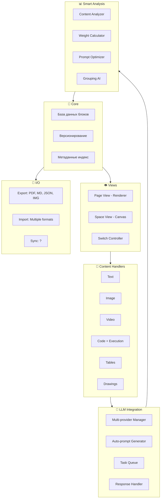

# 🏗️ App Knowledge Builder: Техническое Задание

> **ТЗ НАЙДЕНО НА ТЕЛЕФОНЕ!**  
> Файл: `/storage/emulated/0/Download/тз.md`  
> Дата обнаружения: 2026-02-15  
> **ПРИОРИТЕТ: КРИТИЧЕСКИЙ**

---

## 🎯 Концепция

### Название идеи: **Knowledge Builder / Visual Knowledge Space**

**Концепция:** Гибрид Obsidian + PureRef + LLM-интеграция

**Суть:**  
Визуальный редактор знаний с возможностью переключения между:
- 📄 **Страничный вид** (как Obsidian)
- 🌌 **Пространственный вид** (как PureRef — infinite canvas)

---

## 🚀 Ключевые фичи

### 1. Двойной режим просмотра

```
┌─────────────────────────────────────────┐
│  📄 PAGE VIEW    ↔    🌌 SPACE VIEW   │
│                                         │
│  Страничный       →    Пространственный │
│  [Block1]         →    [Block1]────[B2]│
│  [Block2]         →      │      /     │
│  [Block3]         →    [Block3]       │
│                     Группы/связи      │
└─────────────────────────────────────────┘
```

**Пространственный вид:**
- Каждый блок = прямоугольник который можно двигать
- Блоки можно группировать
- Настраиваемая графика связей (цвет, форма, линии)
- Авто-расширение canvas при перемещении за края

### 2. Типы контента в блоках

- 📝 **Текст** (форматированный)
- 🖼️ **Картинки**
- 🎬 **Видео**
- 📊 **Графики**
- 📋 **Таблицы**
- ✏️ **Рисунки**
- 💻 **Code blocks** (с тестированием!)
- 📦 **Другие файлы**

### 3. Метаданные блока (CRITICALLY IMPORTANT)

```yaml
block:
  creator: [a-z0-9_]+  # Кто создал
  creation_date: ISO8601  # Когда создано
  modification_date: ISO8601  # Последнее изменение
  document_version: number  # Версия документа
  user_priority: 0-1000  # Приоритет владельца
  last_username: string  # Последний редактор
  last_user_priority: 0-100  # Приоритет редактора
  
  # Дополнительно упомянутые:
  tags: []  # Теги
  source_link: url  # Источник
  title: string  # Название
  description: string  # Описание
  author_name: string  # Имя автора
  page_view_order: number  # Порядок в страничном виде
  group_name: string  # Группа
  
  # Связи
  relationships:
    - target_block_id
    - relationship_type
    - metadata
```

### 4. Группировка блоков

**Уровни:**
1. **Метаданные** — теги, группы
2. **Алгоритмическая** — auto-grouping по смыслу
3. **Визуальная** — цвет, форма, обрамление
   - Круг с блоками внутри
   - Квадрт с группой
   - Области тематические

### 5. Подключение LLM

**Типы подключений:**
- 🔗 API нейросетей (OpenAI, Anthropic, local)
- 🔗 Локальные модели (Ollama, etc)
- 🔗 Несколько под разные задачи:
  - OCR: чтение текста с картинок
  - Image recognition: распознавание картинок
  - Voice recognition: распознавание голоса
  - Audio: типы звуков
  - Text analysis: анализ текста
  - Coding: код и отладка
  - И др.

**Авто-генерируемые промпты:**
- На основе веса базы данных → анализ → специализированный промпт
- Две итерации анализа на разных порогах веса
- Настраиваемые пороги

**Специализации баз данных:**

| Тип базы | Промпт фокус |
|----------|--------------|
| Сбор информации | Аналитический |
| Игра разработка | Механика, баланс, код |
| История/Лор | Сюжетные дыры, персонажи, связи |
| Приложение разработка | Код-ревью, описания, баги |
| Общая | Универсальный |

### 6. Функции с LLM

- ✅ **Code testing:** Прямо в приложении
- ✅ **Code improvements:** Suggestions от LLM
- ✅ **Bug fixes:** Авто-предложение исправлений
- ✅ **Auto-descriptions:** Генерация описаний
- ✅ **Content analysis:** Анализ групп блоков

### 7. Версионирование и командная работа

- ✅ **Версии документов:** document_version
- ✅ **Мультиюзер:** creator, last_username
- ✅ **Приоритеты:** user_priority, last_user_priority
- ✅ **Права доступа:** Через приоритеты

### 8. Экспорт/Импорт

- ✅ Экспорт во "все основные форматы"
- ✅ PDF из страничного вида
- ✅ Изображение canvas из space view
- ✅ Markdown/JSON для данных

### 9. Вариативность отображения

- Настраиваемые темы
- Вариативные layout'ы
- Управление из меню настроек

---

## 🏗️ Архитектура (предполагаемая)



---

## 🔧 Технологический стек (предполагаемый)

**Фронтенд:**
- Framework: React/Vue/Svelte + Canvas API
- Space view: Canvas 2D/WebGL (для производительности)
- Page view: Standard DOM/React

**Бэкенд:**
- Local-first: SQLite/IndexedDB
- File format: JSON + binary assets
- Sync: ? (не указано)

**LLM Integration:**
- Unified API layer
- Support: OpenAI, Anthropic, Ollama, custom endpoints

---

## 🎯 Зачем это важно

Этот проект объясняет:

1. **Почему Obsidian:** Тестирование концепции page+spatial view
2. **Почему Knowledge Graph:** Идея визуальных связей между данными
3. **Почему Multi-Agent:** Каждый LLM — отдельный "агент" с задачей
4. **Почему Self-Hosting:** Контроль над данными + LLM
5. **Почему Metadata:** Критично для системы приоритетов и версионирования

**Связь:**  
Текущая работа с Obsidian + Knowledge Graph — это **подготовка** к этому проекту!  
Maksim тестирует концепции которые потом реализует в своем приложении.

---

## 📋 Roadmap мышления

```
СЕЙЧАС:
  Obsidian → Тест page view
  Knowledge Graph → Тест связей
  Multi-Agent → Тест LLM интеграции
  
ПОТОМ:
  PureRef → Тест spatial view
  Разработка → Собственное приложение
  
ЦЕЛЬ:
  Knowledge Builder App
  - Page + Space views
  - LLM integration
  - Metadata system
  - Collaborative
```

---

## 🔗 Связанные проекты

| Проект | Связь |
|--------|-------|
| [[Projects-Active/Multi-Agent]] | Тест LLM агентов |
| [[Knowledge-Graph]] | Тест визуальных связей |
| [[Content-Graph]] | Тест метаданных |
| Obsidian vault | Тест page view |
| GPT conversations | Тест промпт-инжиниринга |
| Zerocoder | Обучение для разработки |

---

## 🚨 Действие

**This is BIG!** Это объясняет всю систему:

- Knowledge Graph не просто для хранения — это тест spatial view
- Content Graph — тест метаданных и категоризации
- Multi-Agent — тест LLM интеграции
- Self-hosting — контроль для разработки

**Maksim готовит инфраструктуру для создания своего приложения!**

---

*CRITICAL FIND | Это центральный проект Максима*