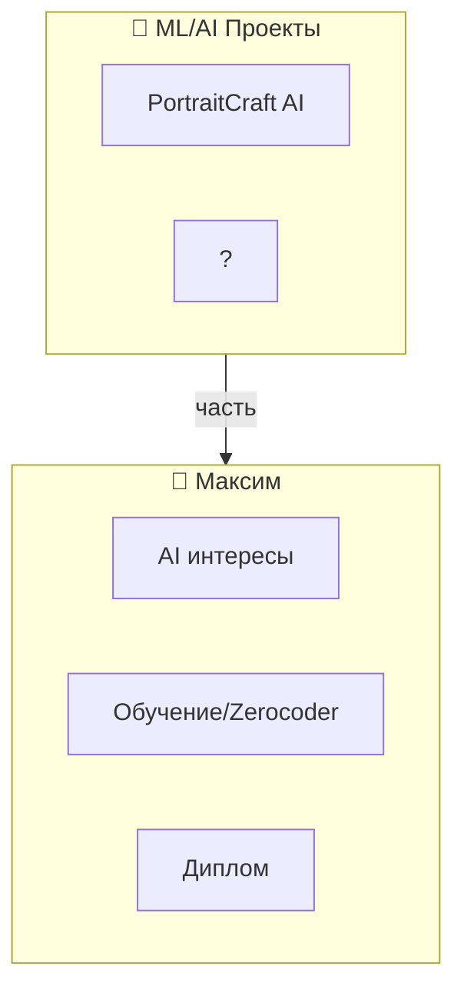

# 🎨 PortraitCraft AI

> Diplom project proposal  
> **НАЙДЕНО В ТЕЛЕГРАМ DOWNLOADS**

---

## 📄 Информация о файле

| Параметр | Значение |
|----------|----------|
| **Файл** | Diplom_PortraitCraftAI_Proposal.docx |
| **Локация** | /storage/emulated/0/Download/Telegram/ |
| **Дата** | 17 июля 2025 |
| **Размер** | 32KB |
| **Статус** | Предложение (Proposal) |
| **Тип** | Дипломный проект |

---

## 🎯 Что это

**PortraitCraft AI** — дипломный проект по созданию AI-системы для портретов/изображений.

(Содержимое .docx требует распаковки для чтения)

---

## 🔗 Связи

- **Тип:** AI/Machine Learning / Image Processing
- **Платформа:** Вероятно desktop/browser
- **Статус:** Планируется/В разработке

---

## 📊 Контекст

---

## 🚨 Инсайт

**Паттерн:** Максим работает над несколькими AI-проектами:
1. Multi-agent system (Джек + Джон)
2. PortraitCraft AI (диплом)
3. Knowledge Graph / Content Organization
4. Possibly game dev / lore / storytelling

**Вывод:** AI/ML — центральная тема, не только инфраструктура

---

*Найдено при сканировании телефона | 2026-02-15*