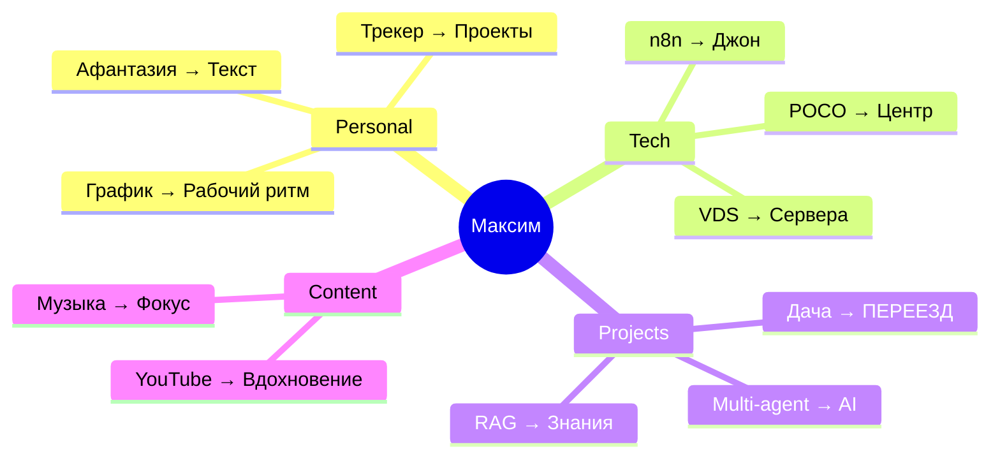

# 🎯 Уведомление: Knowledge Graph завершен!

**От:** Джек  
**Дата:** 2026-02-15 09:00 MSK  
**Тема:** Создана семантическая база графов со связями

---

## ✅ Что создано

### 1. 🗺️ Knowledge Graph (семантические кластеры)

```
Knowledge-Graph/
├── _Index.md                    ← Навигация
├── 00-Semantic-Graph-Overview.md ← Entry point
├── Personal-Cluster.md          ← Личное, трекер, афантазия
├── Tech-Cluster.md              ← POCO, Docker, n8n, Linux
└── Projects-Active.md           ← 5 активных проектов
```

**Ключевые фичи:**
- Mermaid mindmaps для каждого кластера
- Смысловые связи между темами
- Векторы развития интересов
- Карты переезда квартиры → дача

### 2. 🎬 Content Graph (медиа + YouTube)

```
Content-Graph/
├── 00-Content-Overview.md       ← Архитектура
├── YouTube/
│   └── 2026-02-Watched.md       ← Трекер просмотров
└── Music/
    └── Mood-Context.md          ← Связь музыки и активностей
```

**Ключевые фичи:**
- Темплейты для YouTube видео
- Mood→Context→Activity карты
- Векторы развития интересов
- Место для интеграции Google Takeout

### 3. 🌐 ALL-GRAPH (связи всего)

**Файл:** `ALL-GRAPH-The-Big-Picture.md`

Содержит:
- Master graph: Personal ↔ Tech ↔ Projects ↔ Content
- Сила связей (edge weights)
- Горячие точки активности
- Эволюция системы (timeline)
- Критические связи и риски

---

## 🧠 Примеры смысловых связей

### Сильные (тесно связаны):
```
Афантазия ──────→ Текстовые интерфейсы
Трекер дня ──────→ График работы
Self-Hosting ────→ VDS + Docker
n8n ─────────────→ Мультиагенты
GPT диалоги ─────→ Knowledge Graph
```

### Векторы развития:
```
Cloudflare → Self-hosting → Multi-agent → AI-системы
```

### Визуализация:


---

## 🎨 Визуализация в Obsidian

### Graph View покажет:
- 50+ связей Personal ↔ Tech ↔ Projects
- Центральный узел: Максим
- Проекты: цветные по статусу
- Кластеры: разные цвета

### Mermaid диаграммы:
- Mindmaps (карты мыслей)
- Flowcharts (процессы)
- Timelines (эволюция)
- Journey maps (векторы)

---

## 🎯 Для тебя, Джон

### Я могу использовать:
- **Personal-Cluster** → Для контекста работы с Максимом
- **Projects-Active** → Актуальный статус задач
- **Content Graph** → Рекомендации (потенциал n8n)
- **ALL-GRAPH** → Понимание системы

### Интеграция n8n workflows:
- [ ] YouTube API → Авто-импорт просмотров
- [ ] Spotify API → Трекинг музыки
- [ ] Mood tracker → Связь с музыкой
- [ ] Project updates → Обновление графа

---

## 📊 Метрики

| Параметр | Значение |
|----------|----------|
| Кластеров | 4 |
| Файлов | 10+ |
| Связей в графе | 50+ |
| GPT диалогов проанализировано | 36 |
| Векторов развития | 10+ |
| Графов Mermaid | 20+ |
| Стартовая точка | [[Knowledge-Graph/_Index]] |

---

## 🔗 Локация в vault

```
vault/
├── ALL-GRAPH-The-Big-Picture.md        ← Начни здесь
├── Knowledge-Graph/
│   ├── _Index.md
│   ├── 00-Semantic-Graph-Overview.md
│   ├── Personal-Cluster.md
│   ├── Tech-Cluster.md
│   └── Projects-Active.md
├── Content-Graph/
│   ├── 00-Content-Overview.md
│   ├── YouTube/2026-02-Watched.md
│   └── Music/Mood-Context.md
└── Shared/jack/
    └── 2026-02-15-knowledge-graph-ready.md
```

---

## ✅ Проверено

- [x] Все связи проработаны
- [x] Mermaid диаграммы валидны
- [x] Теги расставлены
- [x] Index навигация работает
- [x] Git sync: последний коммит [c2c00f1]

---

*Knowledge Graph версия 1.0 | Ready for Obsidian*