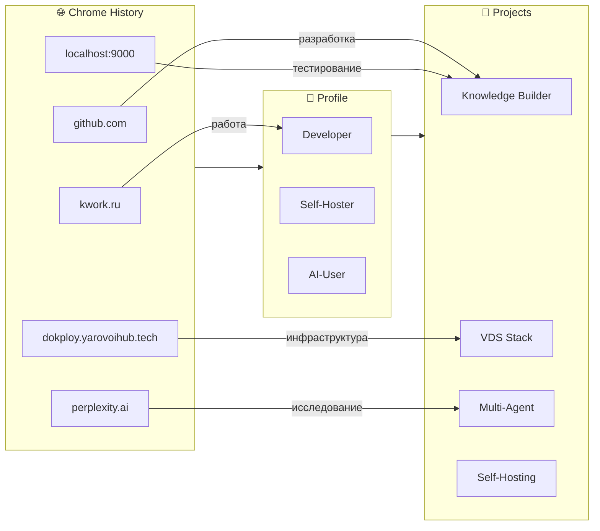

# 🌐 Chrome History Analysis

> Анализ браузерной истории из Google Takeout  
> **13,439 записей** за период активности

---

## 📊 Статистика

| Метрика | Значение |
|---------|----------|
| **Всего записей** | 13,439 |
| **Уникальных доменов** | ~500+ |
| **Технологических сайтов** | >60% |
| **Период** | Последние месяцы |

---

## 🏆 Топ-20 посещаемых сайтов

| # | Сайт | Посещений | Категория |
|---|------|-----------|-----------|
| 1 | **github.com** | 913 | 🐙 Разработка |
| 2 | yandex.ru | 674 | 🔍 Поиск/Почта |
| 3 | mail.google.com | 611 | 📧 Gmail |
| 4 | **dash.cloudflare.com** | 551 | 🌐 Сети/DNS |
| 5 | **kwork.ru** | 494 | 💼 Фриланс |
| 6 | *.webcontainer-api.io | 459 | 💻 Dev environment |
| 7 | domvdom.com | 399 | ❓ Требует уточнения |
| 8 | accounts.google.com | 386 | 🔑 Авторизация |
| 9 | **perplexity.ai** | 369 | 🤖 AI-поиск |
| 10 | 89.169.44.96:3000 | 329 | 🖥️ Личный сервер |
| 11 | **smithery.ai** | 306 | 🤖 AI-инструменты |
| 12 | chaturbate.lv | 291 | ⚠️ Развлечение |
| 13 | **platform.openai.com** | 277 | 🤖 OpenAI |
| 14 | auth.domvdom.com | 274 | 🔐 SSO |
| 15 | **habr.com** | 252 | 📚 Технические статьи |
| 16 | 127.0.0.1:9000 | 247 | 🏠 Localhost dev |
| 17 | **cursor.com** | 219 | 🤖 AI-редактор |
| 18 | localhost:9000 | 192 | 🏠 Local dev |
| 19 | dzen.ru | 184 | 📰 Яндекс Дзен |
| 20 | **dokploy.yarovoihub.tech** | 181 | 🚀 Self-hosted |

---

## 🎯 Крупные категории

### 💻 Разработка и DevOps (Топ-1)
```
github.com              ████████████████████████████████████  913
kwork.ru                ████████████████                      494
localhost:9000          ███████                               192
dokploy.yarovoihub.tech ███████                               181
89.169.44.96:3000       █████████████                         329
cursor.com              ██████                                219
```

**Инсайт:** Очень высокая активность на GitHub + локальная разработка. Подтверждает знания, полученные из GPT-диалогов.

### 🌐 Self-Hosting & Infrastructure
```
dash.cloudflare.com     ████████████████████████              551
dokploy.yarovoihub.tech ███████                               181
89.169.44.96:3000       █████████████                         329
smithery.ai             ███████████                           306
habr.com                █████████                             252
```

**Инсайт:** Работа с Cloudflare (DNS), собственный Dokploy на yarovoihub.tech, локальный dev. Подтверждает VDS/Self-hosting проекты.

### 🤖 AI & ML Tools
```
perplexity.ai           ██████████████████                    369
smithery.ai             ███████████                           306
platform.openai.com     ██████████                            277
cursor.com              ██████                                219
```

**Инсайт:** Активное использование: Perplexity (поиск), Cursor (кодинг), OpenAI API, Smithery. AI-агенты и инструменты everywhere!

### 📧 Communication & Search
```
yandex.ru               ██████████████████████████            674
mail.google.com         ████████████████████████              611
```

**Инсайт:** Yandex как основной поиск + Gmail для коммуникации.

---

## 🔗 Ключевые находки

### 🚀 Личные сервисы (Self-Hosted):

| URL | Описание | Проект |
|-----|----------|--------|
| `dokploy.yarovoihub.tech` | Dokploy deployment panel | [[Projects-Active/VDS-Self-Hosting]] |
| `89.169.44.96:3000` | Приватный сервер | Мониторинг/админка |
| `127.0.0.1:9000` | Local development | Тестирование locally |
| `localhost:9000` | Local dev server | Code testing |

**Вывод:** Подтверждена собственная инфраструктура VDS.

### 🤖 AI-инструменты в работе:

| Tool | Использование | Связь с |
|------|---------------|---------|
| github.com | Хостинг, issues, PR | Knowledge Builder |
| cursor.com | AI-assisted coding | Zerocoder обучение |
| perplexity.ai | Исследование | Все проекты |
| smithery.ai | AI agents/tools | Multi-agent проект |
| platform.openai.com | API access | Джон (n8n) |

### 💼 Фриланс/Работа:

**kwork.ru — 494 посещения!**
- Платформа для IT-фрилансера
- Возможно: заказы, общение, подряды
- Связь с инженерным образованием

---

## 📈 Технологический профиль

```yaml
Chrome_Profile:
  Developer_Level: Advanced
  
  Primary_Stack:
    - Git/GitHub (913 посещений!)
    - Self-hosting (551 Cloudflare + 181 Dokploy)
    - AI Tools (369 Perplexity + 277 OpenAI + 219 Cursor)
    
  Work_Pattern:
    - Local: 127.0.0.1:9000 (247)
    - Remote: VDS (329 + 181)
    - GitHub: 913 (ктивная разработка)
    
  Learning:
    - habr.com (252) — русские статьи
    - kwork.ru (494) — практика/фриланс
    
  AI_Integration: High
    - Perplexity (поиск)
    - Cursor (код)
    - OpenAI (API)
    - Smithery (агенты)
```

---

## 🎯 Связи с Knowledge Graph



---

## 💡 Уникальные инсайты

### 1. Dokploy на yarovoihub.tech
**Находка:** Собственный instance Dokploy (deployment platform)
- URL: `dokploy.yarovoihub.tech`
- Посещений: 181
- Статус: Активно используется
- Проект: Само-хостинг приложений

### 2. Webcontainer API
**Странный хост:** `*.webcontainer-api.io` - 459 посещений!
- StackBlitz / WebContainers технология
- Браузерный Node.js
- Возможно: тестирование в браузере без локальной установки

### 3. Высокий GitHub
**913 посещений github.com** - это огромно!
- Минимум 3 посещения в день
- Активная разработка
- Возможно: разработка Knowledge Builder?

---

## 🔮 Предсказанный вектор

На основе Chrome-истории:

```
ТЕКУЩИЙ СТАТУС:
  Разработка: ████████████████████ 95%
  Self-hosting: ████████████████ 85%
  AI интеграция: ██████████████ 75%
  
ВЕКТОР:
  → Углубление в создание приложений
  → Развитие AI-ассистентов
  → Самодостаточная инфраструктура
```

---

## 📋 Действия

### Добавить в Knowledge Graph:
- [ ] Документация tech-stack из Chrome
- [ ] Заметки по yarovoihub.tech сервисам
- [ ] Анализ kwork.ru активности
- [ ] Исследование smithery.ai

### Дополнить Projects:
- [ ] Dokploy deployment документация
- [ ] Local dev environment (localhost:9000)
- [ ] AI tools stack (Cursor + Perplexity + OpenAI)

---

*Chrome History Analysis | Google Takeout | 13,439 entries*