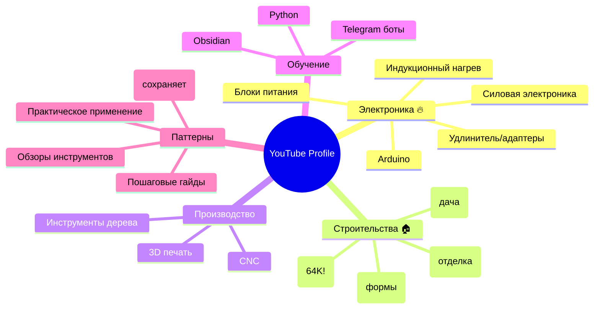
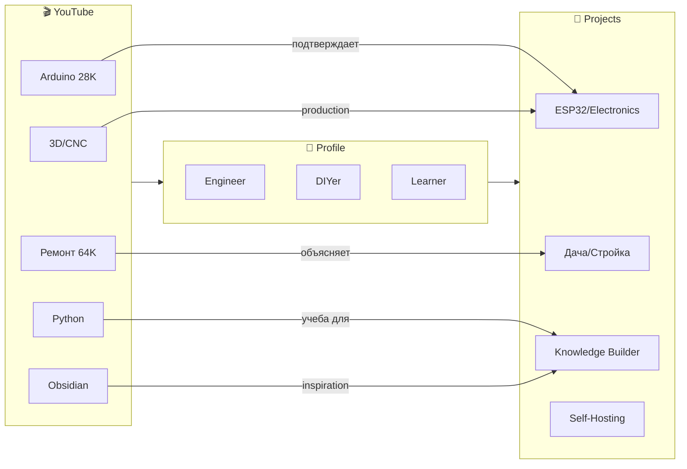

# 🎬 YouTube Profile Analysis

> Полный анализ YouTube активности из Google Takeout

---

## 📊 Статистика

| Метрика | Значение |
|---------|----------|
| **История просмотров** | 27,837 записей |
| **Поисковых запросов** | Данные доступны |
| **Плейлистов** | 28+ |
| **Подписок** | Есть данные (499K файл) |
| **Комментариев** | Данные (31K) |
| **Live чатов** | 20K данных |
| **Music library** | Есть данные |

---

## 🎯 Плейлисты = Интересы

### DIY & Электроника (основное)

| Плейлист | Размер | Описание |
|----------|--------|----------|
| **ARDUINO** | 28K | 🔥 Крупнейший! Электроника |
| **Ремонт** | 64K | 🏠 Второй по размеру! Строительство |
| **3d printer** | 634 | 3D печать |
| **CNC** | 1.5K | ЧПУ станки |
| **Всякие самоделки** | 186K | 🎨 DIY проекты |
| **Индукционный нагрев** | 216 | Электроника/Сварка |
| **Силовая электроника** | 254 | Электроника |
| **отливка** | 824 | Литьё/формы |
| **Эпоксидка** | 3.3K | Материалы/смолы |
| **бп** | 520 | Блоки питания |
| **Септик** | 178 | Дача/строительство |

### Техника & Инструменты

| Плейлист | Размер | Описание |
|----------|--------|----------|
| **Инструменты из дерева** | 672 | 🪵 Деревообработка |
| **Удлинитель** | 482 | Электроника/DIY |

### Обучение & Развитие

| Плейлист | Размер | Описание |
|----------|--------|----------|
| **Python** | 520 | 🐍 Программирование |
| **Obsidian** | 330 | 📝 Организация знаний |
| **Языки** | 140 | Изучение языков |
| **Телеграм** | 1.5K | 🤖 Боты/автоматизация |

### Отложенное & Полезное

| Плейлист | Размер | Описание |
|----------|--------|----------|
| **Watch later** | 186K | 📌 Посмотреть позже |
| **Всякие нужности** | 186K | 🛠️ Utility контент |
| **Интересное** | 185K | 💡 Разное полезное |
| **Сортировка** | 179K | 📊 Вложенность |
| **Много всего** | 181K | Общий |

### Финансы & Инвестиции

| Плейлист | Размер | Описание |
|----------|--------|----------|
| **Криптовалюта** | 140 | 💰 Инвестиции |

### Здоровье

| Плейлист | Размер | Описание |
|----------|--------|----------|
| **Здоровье** | 216 | 🏥 Здоровье |

---

## 🔥 Ключевые инсайты

### 1. Электроника — победитель!

```yaml
ARDUINO:
  размер: 28K
  статус: 🔥 ГЛАВНЫЙ интерес
  навыки:
    - Программирование микроконтроллеров
    - DIY electronics
    - Сенсоры/Актуаторы
    - Проекты IoT
    
другие_электроника:
  - Индукционный нагрев
  - Силовая электроника (бп)
  - Удлинитель (самоделки)
```

**Инсайт:** Из GPT-диалогов был ESP32 интерес. Подтверждено: Arduino огромный плейлист.

### 2. Строительство & Ремонт — вторая стихия!

```yaml
Ремонт:
  размер: 64K
  статус: 🏠 МАССИВНОЕ внимание
  включает:
    - Ремонт квартир/дачи
    - Септик (дача!)
    - Эпоксидка (отделка)
    - Отливка (элементы)
```

**Инсайт:** Связь с переездом на дачу + строительством!

### 3. ЧПУ & Производство

```yaml
3D_печать: & ЧНУ
  - 3d printer (634)
  - CNC (1.5K)
  - Отливка литьё (824)
  
навыки:
  - CAD/CAM
  - Производство деталей
  - Моделирование
```

### 4. Самообразование (техническое)

```
Python     ████.......  (520) - кодинг
Obsidian   ██.........  (330) - knowledge
Telegram   █████...... (1500) - автоматизация
Языки      █..........   (140) - языки
```

### 5. Криптовалюты (инвестиции)

**Криптовалюта плейлист** — отдельный интерес к финансам/инвестициям.

---

## 📈 Профиль потребителя контента

### Тип: Технический DIY-er



---

## 🎯 Связи с Knowledge Graph



---

## 💡 Уникальные находки

### 1. Плейлист "Телеграм" (1.5K)
**Найдено:** Боты, автоматизация, инструменты Telegram
**Связь:** Проект Multi-Agent (Джек + Джон)!

### 2. Размер "Ремонт" vs "Arduino"
- Ремонт: 64K (больше чем Arduino 28K!)
- Это подтверждает переезд и активность на даче

### 3. Obsidian плейлист (330)
**Находка:** Смотрит Obsidian tutorial videos
**Связь:** Текущий vault + будущий Knowledge Builder

### 4. Python плейлист (520)
**Находка:** Активное обучение Python
**Связь:** Termux history (пробовал Python)

---

## 🎨 Тематическое распределение

```pascal
╔════════════════════════════════════════════════════════╗
║  ЭЛЕКТРОНИКА        ████████████████████████  ~30K+    ║
║  (Arduino, сборки, блоки питания)                      ║
╠════════════════════════════════════════════════════════╣
║  СТРОИТЕЛЬСТВО      ████████████████████████  ~64K+    ║
║  (Ремонт, септик, отделка)                            ║
╠════════════════════════════════════════════════════════╣
║  DIY ПРОЕКТЫ        ████████████████████      ~40K+    ║
║  (3D, CNC, самоделки, инструменты)                    ║
╠════════════════════════════════════════════════════════╣
║  ОБУЧЕНИЕ           ████                      ~5K     ║
║  (Python, Obsidian, боты)                            ║
╠════════════════════════════════════════════════════════╣
║  ОТЛОЖЕННОЕ         ████████████████████████  ~700K+   ║
║  (Сохранено на потом)                                 ║
╚════════════════════════════════════════════════════════╝
```

---

## 🚀 Предсказанный вектор развития

На основе YouTube:

```
ТЕКУЩЕЕ:
  Электроника ────────> DIY проекты ───────> Arduino/ESP32
       │                                         │
       └──────────────-> Дача ремонт ─────────────────>
       │                                            │
       └──────────────-> 3D печать ─────────────> Производство
       
ВЕКТОР:
  → Умный дом на даче (Arduino + ремонт + ESP32)
  → Самодельное производство (3D + CNC + электроника)
  → Образовательный контент (Python + Knowledge)
```

---

## 📋 Рекомендации по контенту

### Что Максим смотрит:

| Категория | Примеры каналов |
|-----------|-----------------|
| **Arduino** | Arduino Project Hub, GreatScott |
| **Ремонт** | Строительство, дача, интерьеры |
| **3D печать** | 3DToday, Разработки |
| **CNC** | ЧПУ проекты |
| **Python** | Programming tutorials |
| **Obsidian** | Bryan Jenks, Linking Your Thinking |

### Что рекомендовать:

- [ ] Arduino + ESP32 projects
- [ ] Smart Home DIY
- [ ] Knowledge management systems
- [ ] Python automation
- [ ] 3D modelling tutorials

---

*YouTube Analysis | Google Takeout | Плейлисты = карта интересов*